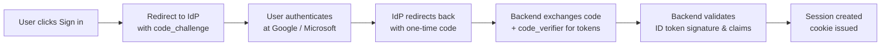
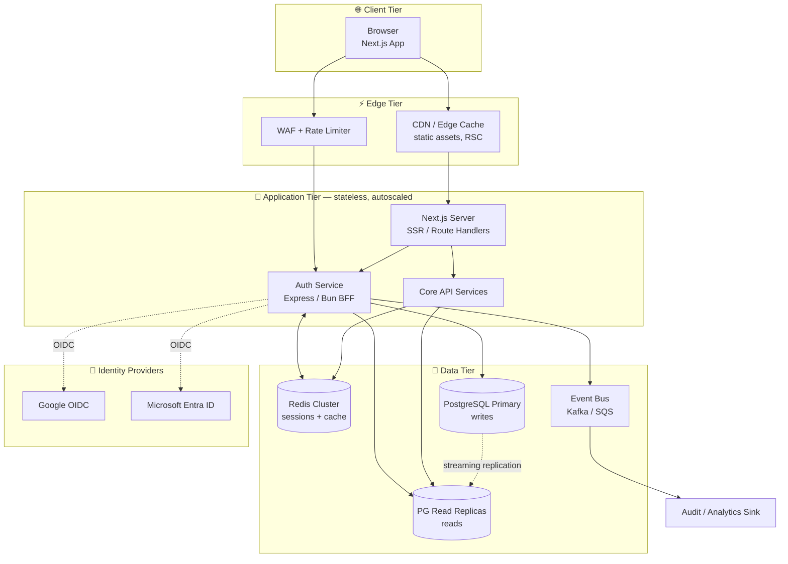
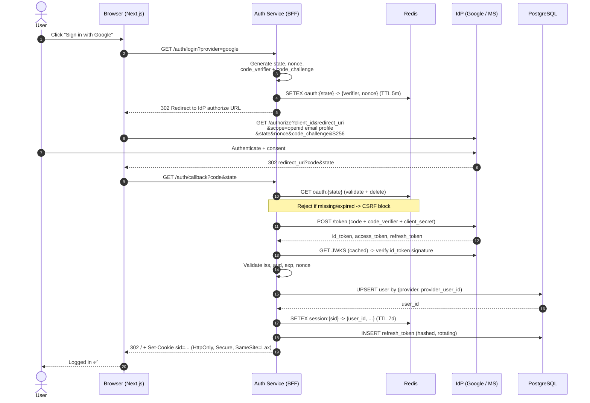
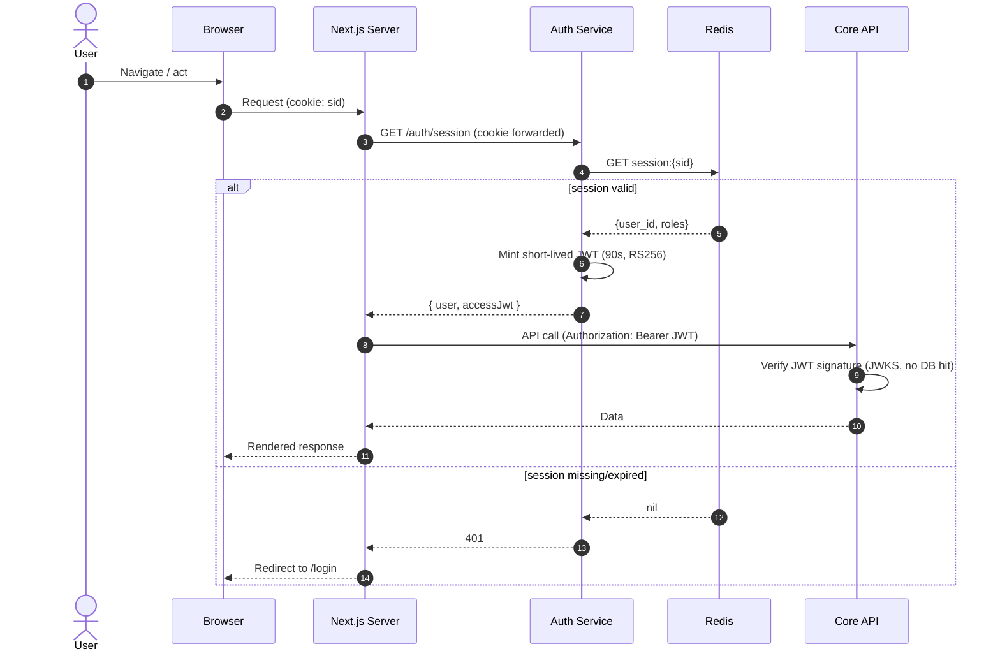
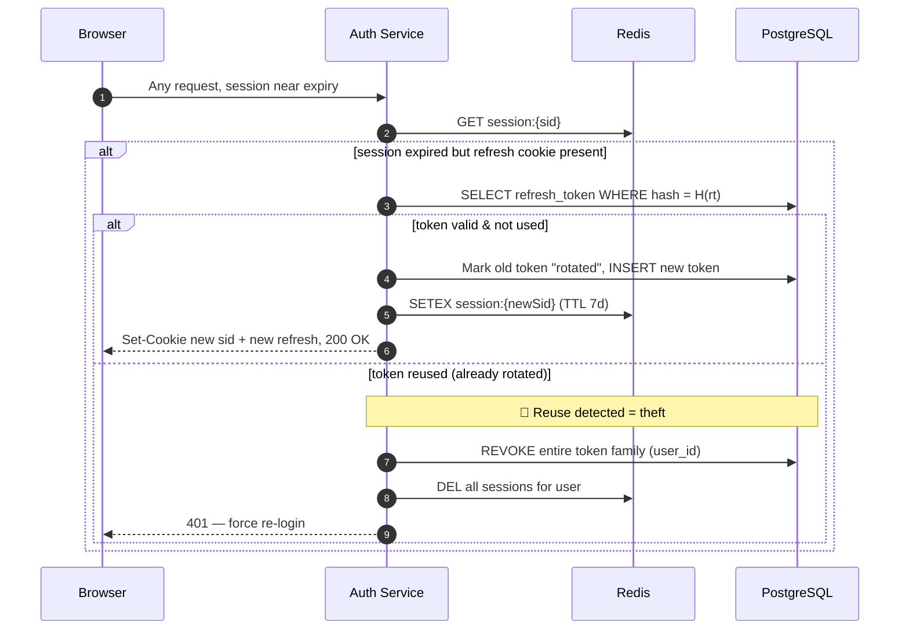
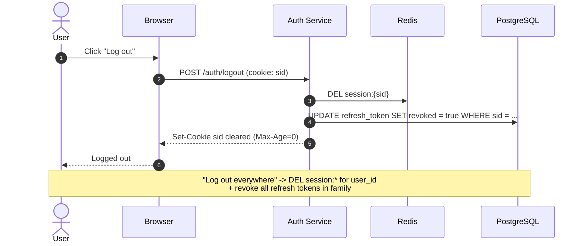
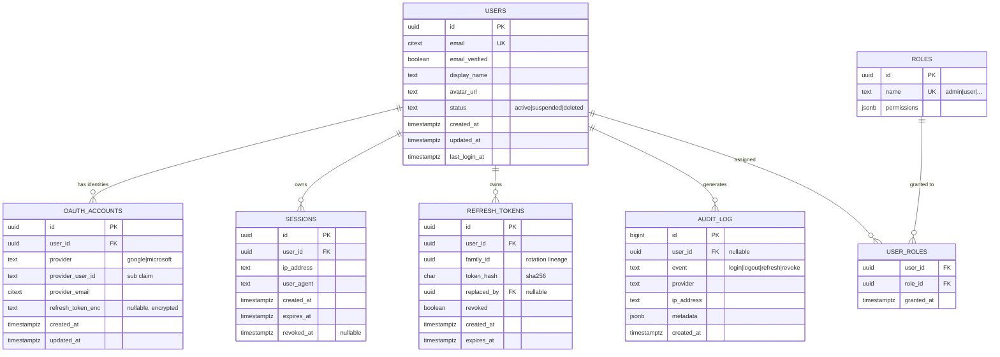
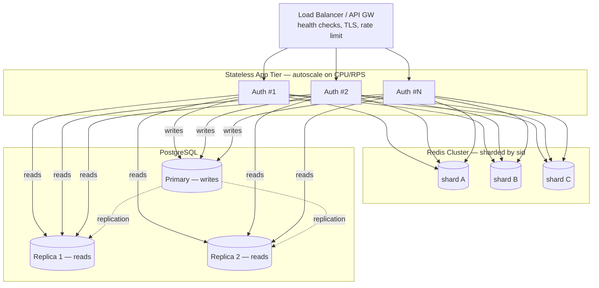

# Authentication Architecture — OAuth 2.0 / OIDC with Google & Microsoft

> Social sign-in (Google + Microsoft) for a web platform engineered for **10M users**.
> Backend: **Node / Bun + Express** · Frontend: **Next.js** · Datastore: **PostgreSQL + Prisma** · Cache/Sessions: **Redis**.

---

## Table of Contents

1. [Goals & Non-Goals](#1-goals--non-goals)
2. [Core Decisions at a Glance](#2-core-decisions-at-a-glance)
3. [Protocol Primer — Why Authorization Code + PKCE](#3-protocol-primer--why-authorization-code--pkce)
4. [High-Level System Architecture](#4-high-level-system-architecture)
5. [Control Flow — Sequence Diagrams](#5-control-flow--sequence-diagrams)
6. [Token & Session Strategy](#6-token--session-strategy)
7. [Database Design](#7-database-design)
8. [API Surface](#8-api-surface)
9. [Scaling to 10M Users](#9-scaling-to-10m-users)
10. [Security Hardening](#10-security-hardening)
11. [Observability & Operations](#11-observability--operations)
12. [Failure Modes & Mitigations](#12-failure-modes--mitigations)
13. [Appendix — Config, Env, Glossary](#13-appendix)

---

## 1. Goals & Non-Goals

### Goals

| # | Goal | Success Criteria |
|---|------|------------------|
| G1 | Passwordless social login via Google & Microsoft | User signs in with one click, no password stored |
| G2 | Horizontal scalability to 10M users / ~500k DAU | p99 auth latency < 250 ms at peak |
| G3 | Stateless API tier | Any node serves any request; no sticky sessions |
| G4 | Secure-by-default token handling | No tokens in `localStorage`; refresh-token rotation |
| G5 | Account linking | One identity across multiple providers |
| G6 | Auditability | Every auth event is traceable and queryable |

### Non-Goals

- Building our own password/credential store (delegated to IdPs).
- Implementing an OAuth **authorization server** — we are a **client / relying party** only.
- Multi-tenant SSO/SAML for enterprises (separate future workstream).

---

## 2. Core Decisions at a Glance

| Concern | Decision | Rationale |
|--------|----------|-----------|
| OAuth flow | **Authorization Code + PKCE** | Industry standard for web apps; immune to code interception |
| Where the flow runs | **Backend-for-Frontend (BFF)** on Express | Client secret + tokens never reach the browser |
| Session transport | **Opaque session ID in `HttpOnly` cookie** | XSS-resistant; revocable server-side |
| Session store | **Redis** (session ↔ user mapping) | O(1) lookup, instant revocation, TTL eviction |
| Internal API auth | **Short-lived JWT** minted by auth service | Stateless verification across microservices |
| Refresh tokens | **Rotating, hashed at rest, in Postgres** | Replay detection; revocation on theft |
| ORM | **Prisma** | Type-safe, great migrations DX; swap to Drizzle if raw-SQL control is needed |
| Provider abstraction | **OIDC discovery + `openid-client`** | Google & Microsoft both speak OIDC; one code path |

> **Why a BFF and not pure SPA token handling?**
> A Next.js SPA holding access/refresh tokens in JS is exposed to XSS exfiltration. By terminating OAuth on the Express BFF and handing the browser only an opaque `HttpOnly` cookie, the browser never touches an IdP token. This is the OWASP-recommended pattern for first-party web apps.

---

## 3. Protocol Primer — Why Authorization Code + PKCE

OAuth 2.0 / OpenID Connect (OIDC) defines several grant types. For a first-party web app with a backend, the only correct choice in 2026 is the **Authorization Code grant with PKCE** (Proof Key for Code Exchange).



**Key protocol artifacts**

| Artifact | Purpose | Lifetime |
|----------|---------|----------|
| `state` | CSRF protection; binds callback to the initiating request | One request (~5 min) |
| `nonce` | Replay protection; echoed inside the ID token | One request |
| `code_verifier` / `code_challenge` | PKCE — proves the token-exchange caller is the same app that started the flow | One request |
| **Authorization code** | One-time credential exchanged server-side for tokens | ~30–60 s, single use |
| **ID token** (JWT) | Proves *who* the user is (OIDC); signed by IdP | ~1 h (we consume once) |
| **Access token** | Calls IdP APIs (e.g. Graph, userinfo) | ~1 h |
| **Refresh token** (from IdP) | Re-fetch IdP profile without re-consent | Long-lived (optional to store) |

> We use the **ID token** purely to establish identity, then mint **our own** session + JWTs. We do **not** forward IdP access tokens to our frontend.

---

## 4. High-Level System Architecture



### Responsibilities by component

| Component | Responsibility | Stateless? |
|-----------|----------------|:----------:|
| **Next.js (Edge/SSR)** | UI, server components, redirect to `/auth/login`, read session via BFF | ✅ |
| **Auth Service (Express/Bun BFF)** | OAuth dance, token validation, session + JWT minting, refresh rotation | ✅ |
| **Core API** | Business logic; verifies JWT or session on each request | ✅ |
| **Redis Cluster** | Session store, PKCE/state cache, rate-limit counters, hot-user cache | ❌ (state) |
| **PostgreSQL** | Source of truth: users, identities, refresh tokens, audit log | ❌ (state) |
| **Event Bus** | Async fan-out: welcome email, audit, analytics | ❌ |

> The entire **App Tier is stateless** — all session state lives in Redis and Postgres. This is the keystone that lets us add nodes linearly behind a load balancer to reach 10M users.

---

## 5. Control Flow — Sequence Diagrams

### 5.1 Login — Authorization Code Flow with PKCE



**Critical validation gates (step-by-step)**

1. `state` must match a live Redis entry — else reject (CSRF / replay).
2. Authorization code is exchanged **server-side only**, with `code_verifier` (PKCE) and the client secret.
3. ID token signature verified against the IdP's **JWKS** (cached, key-rotation aware).
4. Claims checked: `iss` (correct provider), `aud` (our client_id), `exp`/`iat`, and `nonce` matches.
5. Only then do we create a user/session.

---

### 5.2 Authenticated API Request — Session → JWT



> **Two-token model:** the browser holds an **opaque session** (revocable); internal service-to-service calls use a **short-lived JWT** (stateless, fast). Core API never hits Redis/DB to verify identity — it just checks a signature.

---

### 5.3 Refresh-Token Rotation (sliding session)



**Refresh-token reuse detection** is the defense against stolen tokens: each refresh issues a new token and invalidates the old one. If an old (already-rotated) token is ever presented, the whole token *family* is revoked and the user is forced to re-authenticate.

---

### 5.4 Logout (single + global)



---

## 6. Token & Session Strategy

| Token | Type | Storage | Lifetime | Revocable | Verification |
|-------|------|---------|----------|:---------:|--------------|
| **Session ID** | Opaque random (256-bit) | `HttpOnly` cookie ↔ Redis | 7 days sliding | ✅ instant | Redis lookup |
| **Access JWT** | RS256 JWT | In-memory, never persisted | 60–90 s | ⚠️ via short TTL | Signature only |
| **Refresh token** | Opaque random, **hashed** | Cookie ↔ Postgres (SHA-256 at rest) | 30 days, rotating | ✅ instant | DB lookup |
| **IdP ID token** | JWT from Google/MS | Consumed, not stored | n/a | n/a | JWKS signature |

### Why this split?

- **Opaque session for the browser** → revocable on logout/compromise, XSS-resistant (`HttpOnly`).
- **Short JWT for internal calls** → Core API scales without touching the session store on every request; the tiny TTL bounds the blast radius of a leaked JWT.
- **Rotating refresh in Postgres** → durable, auditable, supports reuse-detection and "log out everywhere."

### Cookie attributes (non-negotiable)

```
Set-Cookie: sid=<opaque>;
  HttpOnly;          // JS cannot read it -> XSS-safe
  Secure;            // HTTPS only
  SameSite=Lax;      // CSRF mitigation; Lax allows top-level OAuth redirect
  Path=/;
  Max-Age=604800;    // 7d
  Domain=.example.com
```

---

## 7. Database Design

### 7.1 Entity-Relationship Diagram



### 7.2 Design rationale

| Decision | Why |
|----------|-----|
| **`users` separate from `oauth_accounts`** | One human, many identities. Lets the same user link Google **and** Microsoft to a single account. |
| **Unique `(provider, provider_user_id)`** | The IdP `sub` claim is the stable key — emails can change, `sub` cannot. |
| **`citext` for email** | Case-insensitive matching without `LOWER()` gymnastics. |
| **UUID v7 primary keys** | Time-sortable, index-friendly, shard-safe, no central sequence bottleneck. |
| **Refresh tokens hashed (SHA-256)** | A DB leak does not expose usable tokens. |
| **`family_id` + `replaced_by`** | Encodes rotation lineage → enables reuse-detection and family-wide revocation. |
| **`audit_log` append-only** | Compliance + forensics; partitioned by month for retention. |

### 7.3 Prisma schema (excerpt)

```prisma
model User {
  id            String         @id @default(dbgenerated("uuidv7()")) @db.Uuid
  email         String         @unique @db.Citext
  emailVerified Boolean        @default(false)
  displayName   String?
  avatarUrl     String?
  status        UserStatus     @default(ACTIVE)
  createdAt     DateTime       @default(now())
  updatedAt     DateTime       @updatedAt
  lastLoginAt   DateTime?

  accounts      OAuthAccount[]
  sessions      Session[]
  refreshTokens RefreshToken[]
  roles         UserRole[]

  @@index([status])
  @@map("users")
}

model OAuthAccount {
  id             String   @id @default(dbgenerated("uuidv7()")) @db.Uuid
  userId         String   @db.Uuid
  provider       Provider
  providerUserId String   // OIDC `sub`
  providerEmail  String?  @db.Citext
  createdAt      DateTime @default(now())

  user           User     @relation(fields: [userId], references: [id], onDelete: Cascade)

  @@unique([provider, providerUserId])
  @@index([userId])
  @@map("oauth_accounts")
}

model RefreshToken {
  id         String   @id @default(dbgenerated("uuidv7()")) @db.Uuid
  userId     String   @db.Uuid
  familyId   String   @db.Uuid
  tokenHash  String   @unique
  replacedBy String?  @db.Uuid
  revoked    Boolean  @default(false)
  createdAt  DateTime @default(now())
  expiresAt  DateTime

  user       User     @relation(fields: [userId], references: [id], onDelete: Cascade)

  @@index([userId])
  @@index([familyId])
  @@map("refresh_tokens")
}

enum Provider { GOOGLE MICROSOFT }
enum UserStatus { ACTIVE SUSPENDED DELETED }
```

> **Sessions live in Redis, not Postgres, on the hot path.** The `sessions` table is an optional durable mirror for "see all my devices" UX and forensics; the authoritative fast lookup is Redis `session:{sid}`.

---

## 8. API Surface

| Method | Endpoint | Purpose | Auth |
|--------|----------|---------|------|
| `GET` | `/auth/login?provider=` | Start OAuth; redirect to IdP | Public |
| `GET` | `/auth/callback` | IdP redirect target; exchange code, create session | Public (state-bound) |
| `GET` | `/auth/session` | Return current user + mint short JWT | Cookie |
| `POST` | `/auth/refresh` | Rotate refresh token, extend session | Refresh cookie |
| `POST` | `/auth/logout` | Revoke current session | Cookie |
| `POST` | `/auth/logout-all` | Revoke all sessions for user | Cookie |
| `POST` | `/auth/link?provider=` | Link an additional IdP to current account | Cookie |
| `GET` | `/.well-known/jwks.json` | Public keys for Core API to verify our JWTs | Public |

**Design notes**

- All mutating endpoints require the session cookie **and** a `SameSite` policy; state-changing POSTs additionally carry a CSRF token (double-submit) for defense in depth.
- `/auth/callback` is the *only* registered `redirect_uri` per provider — locked down at the IdP console.

---

## 9. Scaling to 10M Users

> 10M registered users ≈ **500k DAU**, peaking around **2–4k auth requests/sec**. Login itself is bursty and cheap; the steady-state cost is **session verification on every request**, which is why session lookups must be O(1).

### 9.1 Capacity model

| Metric | Estimate | Implication |
|--------|----------|-------------|
| Registered users | 10,000,000 | `users` table ~ a few GB; trivial for Postgres |
| DAU | ~500,000 | Active sessions in Redis |
| Logins/day | ~600,000 | ~7/sec avg, ~50/sec peak — light |
| Authenticated reqs/sec (peak) | ~3,000 | **Session check is the hot path** |
| Avg session object | ~400 bytes | 500k × 400 B ≈ **200 MB** in Redis — fits in RAM easily |

### 9.2 Where each layer scales



### 9.3 Scaling levers (in priority order)

1. **Stateless app tier** — sessions in Redis, identity via signed JWT. Add pods linearly; no sticky sessions, no node affinity.
2. **Redis Cluster, sharded by `sid`** — session reads scale horizontally; each shard holds a slice of the keyspace with replicas for HA.
3. **Read replicas for Postgres** — auth reads (user lookup, role checks) hit replicas; only writes (new user, token rotation, audit) hit the primary.
4. **JWKS caching** — IdP public keys and our own signing keys are cached in-process with TTL; verification is pure CPU, zero network on the hot path.
5. **Connection pooling (PgBouncer)** — 100s of app pods × few connections would exhaust Postgres; a pooler multiplexes them to a small primary connection set.
6. **Async side-effects via event bus** — welcome emails, analytics, audit enrichment are published to Kafka/SQS, never blocking the login response.
7. **CDN + edge for Next.js** — static and cacheable SSR served at the edge; only the auth/session calls reach origin.
8. **Multi-region (future)** — geo-routed edge; Redis per region; Postgres primary in one region with cross-region replicas, or a distributed SQL engine if write-locality demands it.

### 9.4 Postgres partitioning & retention

| Table | Strategy |
|-------|----------|
| `users`, `oauth_accounts` | Single table; B-tree indexes; UUID v7 keeps inserts sequential-ish |
| `refresh_tokens` | Background job purges expired/revoked rows nightly |
| `audit_log` | **Range-partitioned by month**; old partitions detached/archived to cold storage |
| `sessions` (mirror) | TTL cleanup job; Redis is authoritative |

> **Sharding the users table is not needed at 10M.** A single well-indexed Postgres primary with replicas handles tens of millions of rows comfortably. Premature sharding adds operational cost for no benefit — revisit only at the 100M+ / write-bound horizon.

---

## 10. Security Hardening

| Threat | Mitigation |
|--------|------------|
| **CSRF on login** | `state` parameter bound to a Redis entry; rejected if absent/expired |
| **CSRF on API** | `SameSite=Lax` cookies + double-submit CSRF token on mutations |
| **Authorization-code interception** | **PKCE** (S256) — code is useless without the `code_verifier` |
| **XSS token theft** | No tokens in JS; session is `HttpOnly`; strict CSP; access JWT only in memory |
| **Token replay** | `nonce` in ID token; refresh-token **rotation + reuse detection** |
| **ID-token forgery** | Signature verified against IdP **JWKS**; `iss`/`aud`/`exp` strictly checked |
| **Open redirect** | `redirect_uri` allowlisted at IdP; internal `returnTo` validated against allowlist |
| **Session fixation** | New `sid` minted on every login and on every refresh rotation |
| **Brute force / abuse** | WAF + per-IP and per-account rate limits in Redis (token bucket) |
| **Data-at-rest leak** | Refresh tokens hashed; IdP refresh tokens encrypted (AES-256-GCM, KMS-managed key) |
| **Key compromise** | Short JWT TTL bounds exposure; signing keys rotated via JWKS with overlap window |
| **Account takeover via email reuse** | Link by IdP `sub`, not email; require verified email before auto-linking |

### Token-handling rules (enforced in code review)

- ❌ Never put access or refresh tokens in `localStorage` / `sessionStorage`.
- ❌ Never log token values; log token **IDs / hashes** only.
- ✅ All cookies `HttpOnly` + `Secure` + `SameSite`.
- ✅ Every IdP token validated for `iss`, `aud`, `exp`, `nonce` before trust.
- ✅ Refresh rotation is **atomic** (single transaction) to avoid race-window double-spend.

---

## 11. Observability & Operations

### Golden signals

| Signal | Metric | Alert threshold (example) |
|--------|--------|---------------------------|
| Latency | p99 `/auth/session` | > 250 ms for 5 min |
| Latency | p99 `/auth/callback` | > 1.5 s (includes IdP round-trip) |
| Errors | OAuth callback failure rate | > 2% |
| Errors | JWKS fetch failures | any sustained failure |
| Saturation | Redis memory / CPU | > 75% |
| Saturation | PG primary connections | > 80% of pool |
| Security | Refresh-token reuse events | any spike (possible breach) |

### What we emit

- **Structured logs** with a `trace_id` propagated from edge → auth → core API.
- **Metrics** (Prometheus): login success/failure by provider, session hits/misses, rotation counts.
- **Traces** (OpenTelemetry) across the OAuth round-trip to pinpoint IdP latency vs. our own.
- **Audit events** to an append-only sink for compliance (who logged in, from where, when).

### Key rotation runbook (summary)

1. Generate new signing keypair; publish public key to `/.well-known/jwks.json` alongside the old one.
2. Switch signer to new `kid`; old JWTs still verify against the still-published old key.
3. After max JWT TTL (minutes), retire the old key from JWKS.

---

## 12. Failure Modes & Mitigations

| Failure | Blast radius | Mitigation |
|---------|--------------|------------|
| IdP (Google/MS) outage | New logins fail | Existing sessions unaffected; show graceful "try other provider"; status page |
| Redis shard down | Sessions on that shard unavailable | Replica failover; sessions reconstructable from refresh token → re-login worst case |
| Postgres primary down | No new users / rotations | Replica promotion (managed failover); reads continue from replicas |
| JWKS endpoint slow | Verification stalls | In-process cache with stale-while-revalidate; never block on live fetch |
| Clock skew | Token `exp`/`nonce` checks fail | NTP-synced hosts; small leeway (±60s) on `exp` validation |
| Thundering herd after deploy | Mass session re-validation | Staggered rollout; Redis warm; circuit breakers on downstream |

---

## 13. Appendix

### 13.1 Environment & configuration

```bash
# OAuth — Google
GOOGLE_CLIENT_ID=...
GOOGLE_CLIENT_SECRET=...
GOOGLE_DISCOVERY_URL=https://accounts.google.com/.well-known/openid-configuration

# OAuth — Microsoft (Entra ID)
MS_CLIENT_ID=...
MS_CLIENT_SECRET=...
MS_DISCOVERY_URL=https://login.microsoftonline.com/common/v2.0/.well-known/openid-configuration

# Shared
OAUTH_REDIRECT_URI=https://app.example.com/auth/callback
SESSION_TTL_SECONDS=604800
JWT_TTL_SECONDS=90
JWT_SIGNING_ALG=RS256

# Infra
DATABASE_URL=postgresql://...
DATABASE_REPLICA_URL=postgresql://...
REDIS_URL=rediss://...
KMS_KEY_ID=...
```

### 13.2 Provider scope reference

| Provider | Scopes requested | Identity claim |
|----------|------------------|----------------|
| Google | `openid email profile` | `sub` |
| Microsoft | `openid email profile User.Read` | `sub` / `oid` |

### 13.3 Why Prisma (and when to pick Drizzle instead)

| Need | Prisma | Drizzle |
|------|:------:|:-------:|
| Type-safe queries | ✅ | ✅ |
| Migration tooling DX | ✅ excellent | ✅ good |
| Raw-SQL control / lightweight runtime | ⚠️ heavier client | ✅ closer to SQL |
| Edge/serverless cold-start | ⚠️ improving | ✅ leaner |

> Default to **Prisma** for velocity and type safety. Switch to **Drizzle** if you need fine-grained SQL control, the smallest possible runtime, or edge-first deployment. The schema and access patterns above port cleanly to either.

### 13.4 Glossary

| Term | Meaning |
|------|---------|
| **OIDC** | OpenID Connect — identity layer on top of OAuth 2.0 |
| **IdP** | Identity Provider (Google, Microsoft Entra ID) |
| **PKCE** | Proof Key for Code Exchange — binds the token exchange to the flow initiator |
| **BFF** | Backend-for-Frontend — server that brokers auth so the browser never holds IdP tokens |
| **JWKS** | JSON Web Key Set — published public keys used to verify JWT signatures |
| **RP** | Relying Party — our app, which relies on the IdP to authenticate users |
| **Token family** | Lineage of rotated refresh tokens; revoked as a unit on reuse |

---

### Design principles recap

1. **Delegate identity, own the session.** Let Google/Microsoft prove who the user is; we control access from there.
2. **Stateless app, stateful edges.** All state in Redis + Postgres → linear horizontal scaling.
3. **Opaque to the browser, signed between services.** Revocable sessions for users, fast JWTs for internals.
4. **Rotate and detect.** Refresh-token rotation + reuse detection turns token theft into an automatic lockout.
5. **Secure by default, observable always.** Every token validated, every auth event audited.

*Document version 1.0 — living document; revise as the platform evolves.*
