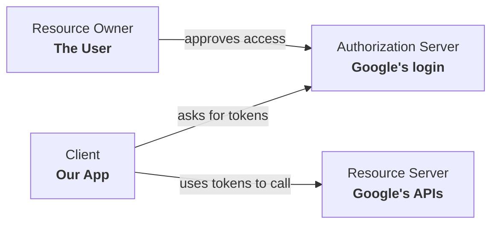

# Chapter 1 — OAuth Fundamentals

Before we write a single line of code, let's make sure the *concepts* are crystal clear. Almost every login bug and security hole comes from a fuzzy mental model here. Spend 15 minutes on this chapter and the rest of the guide will feel obvious.

---

## 1.1 The problem OAuth solves

You want users to log in with their Google account. The naive idea — "ask the user for their Google password and check it" — is a disaster: you'd be handling Google passwords, you'd be a giant hacking target, and Google would (rightly) never allow it.

**OAuth 2.0** is the protocol that lets this happen *without* your app ever seeing the user's Google password. Instead, Google authenticates the user and hands your app a **proof** that "yes, this is user X."

> **Analogy — the valet key.** A valet key starts the car and opens the door but won't open the trunk or glovebox. OAuth is the valet key of the internet: Google gives your app a limited, scoped permission instead of the user's master key (their password).

---

## 1.2 OAuth vs OIDC — the one-sentence difference

You'll see both terms. Here's the distinction that actually matters:

| Protocol | Question it answers | Analogy |
|----------|--------------------|---------|
| **OAuth 2.0** | "Is this app *allowed to do* something on the user's behalf?" (authorization) | A key that opens specific doors |
| **OpenID Connect (OIDC)** | "*Who is* this user?" (authentication) | A photo ID card |

OAuth was originally designed for *authorization* ("let this app read your Google Calendar"). But everyone really wanted *authentication* ("let this user log in"). So **OIDC was added as a thin layer on top of OAuth 2.0** to answer "who is this?" properly.

**OIDC's headline feature is the ID token** — a signed document that says "this is user `sub=12345`, email `a@b.com`, verified by Google." For login, the ID token is the prize. We'll use plain OAuth mechanics (the handshake) to obtain an OIDC ID token.

> When you request the **`openid`** scope, you're switching on OIDC. That's the difference between "OAuth" and "OIDC" in practice — one scope.

---

## 1.3 The four players

Every OAuth flow has the same cast. Learn these names — the official specs and Google's docs use them everywhere.



| Player | Spec name | In our app |
|--------|-----------|-----------|
| The human logging in | **Resource Owner** | The user in their browser |
| The app wanting to log them in | **Client** | Our Express backend |
| The thing that authenticates the user and issues tokens | **Authorization Server** | `accounts.google.com` |
| The API the tokens unlock | **Resource Server** | Google's user-info endpoint (we barely use it) |

Our app is the **Client**. Notice what we are *not*: we are **not** an Authorization Server. We don't build a login screen for Google passwords — Google does that. This is called being a **Relying Party (RP)**: we *rely* on Google to do the authentication.

---

## 1.4 The OAuth "flows" — and why we pick one

OAuth defines several **grant types** (also called flows). You only need to know that the right one for a web app with a backend is the **Authorization Code flow**, hardened with **PKCE**. Here's the menu and why the others are wrong for us:

| Flow | What it's for | Should we use it? |
|------|---------------|-------------------|
| **Authorization Code + PKCE** | Web/mobile apps. The app gets a one-time **code**, then swaps it for tokens on the **backend**. | ✅ **Yes — this is the one.** |
| Implicit | Old SPA hack: tokens returned directly in the URL. | ❌ No — deprecated, leaks tokens in URLs. |
| Client Credentials | Machine-to-machine, no user involved. | ❌ No — there's a human here. |
| Resource Owner Password | App collects the user's password directly. | ❌ No — defeats the whole point. |

### Why "Authorization Code" is clever

The key insight: **the sensitive token exchange happens server-to-server**, never in the browser.

1. Google sends the browser a short-lived, one-time **authorization code** (harmless on its own).
2. The browser hands that code to *our backend*.
3. Our backend secretly exchanges the code (plus our `client_secret`) for the real tokens, over a direct HTTPS call to Google.

So even if someone steals the code from the browser, it's useless without the backend's secret — and it can only be used once.

### Why PKCE on top

**PKCE** (Proof Key for Code Exchange, pronounced "pixy") closes one remaining gap: *what if an attacker intercepts the authorization code and tries to redeem it themselves?*

PKCE works like a claim ticket:

1. Before starting, our backend invents a random secret, the **`code_verifier`**, and sends Google only its *hash*, the **`code_challenge`**.
2. When we later redeem the code, we must present the original `code_verifier`.
3. Google hashes it and checks it matches the challenge from step 1.

An attacker who steals the code never had the `code_verifier`, so they can't redeem it. PKCE was born for mobile apps but is now recommended for **everyone**, web backends included. We'll use it.

---

## 1.5 The tokens & secrets you'll meet

This is the vocabulary for the whole flow. Don't memorize — just get the *shape* of each. Chapters 3 and 4 show exactly where each one appears.

### Things that exist only during the ~10-second login handshake

| Name | What it is | Lifetime |
|------|-----------|----------|
| **`state`** | A random string we generate to detect forged callbacks (CSRF). Google echoes it back; we check it matches. | One login attempt (~10 min) |
| **`nonce`** | A random string baked into the ID token to detect replays. We check it matches. | One login attempt |
| **`code_verifier` / `code_challenge`** | The PKCE secret and its hash (explained above). | One login attempt |
| **Authorization code** | A one-time ticket from Google that we swap for tokens. | ~1 minute, single use |

### Things Google gives us after the handshake

| Name | What it is | Do we keep it? |
|------|-----------|----------------|
| **ID token** | A signed JWT proving who the user is (`sub`, `email`, `name`, ...). **This is what we want.** | We read it once, then discard it. |
| **Google access token** | Lets us call Google's APIs (e.g. fetch the profile). | We don't need it — the ID token already has the profile. |
| **Google refresh token** | Lets us get new Google access tokens later. | Only needed if we call Google APIs over time. For pure login, no. |

### Things WE create and keep (Chapter 4)

| Name | What it is | Lifetime |
|------|-----------|----------|
| **Our access token** | A short JWT *we* sign, proving the user is logged into *our* app. Sent on every request. | ~15 minutes |
| **Our refresh token** | A long, opaque random string that buys a fresh access token. One per device/session. | ~30 days |

> **The most important sentence in this guide:** Google's tokens get us *through the door once*. After that, we mint **our own** access and refresh tokens and live entirely on those. We do not keep calling Google.

---

## 1.6 What is a JWT? (since we'll lean on it)

A **JWT** (JSON Web Token, pronounced "jot") is just a string with three parts separated by dots:

```
eyJhbGciOi...   .   eyJzdWIiOiI...   .   SflKxwRJSM...
   HEADER              PAYLOAD            SIGNATURE
```

- **Header** — which algorithm signed it (e.g. `HS256`).
- **Payload** — the data ("claims"): `sub` (user id), `exp` (expiry), etc. **This is readable by anyone** — it's just Base64, *not* encrypted. Never put secrets in it.
- **Signature** — a cryptographic stamp. Only someone with the secret key can produce it, but *anyone with the public key (or shared secret) can verify it*.

The magic property: **you can verify a JWT is authentic and untampered without a database lookup** — you just re-check the signature with the key. That single fact is what makes fast, scalable auth possible (Chapter 8 leans on it heavily).

> An **opaque token**, by contrast, is just a random string with no readable content — like `a7Fb9...`. To know what it means, you *must* look it up in a database. We'll use JWTs for access tokens (fast, self-describing) and opaque tokens for refresh tokens (because we *want* a database lookup there — it gives us revocation).

---

## 1.7 Mental model check

Before moving on, you should be able to answer these in one sentence each:

- *Why don't we ask the user for their Google password?* → So we never handle it; Google authenticates, we just get proof.
- *What's the difference between OAuth and OIDC?* → OAuth = "allowed to do?"; OIDC = "who is this?" (the `openid` scope + ID token).
- *Why Authorization Code flow?* → The token exchange happens server-side with a secret, so stolen browser data is useless.
- *What does PKCE add?* → Proof that whoever redeems the code is the same app that started the flow.
- *What do we keep from Google?* → Just the identity from the ID token. Then we mint our own tokens.

Got them? Good — now let's see where each piece lives.

**Next:** [Chapter 2 → System Architecture](./02-system-architecture.md)
