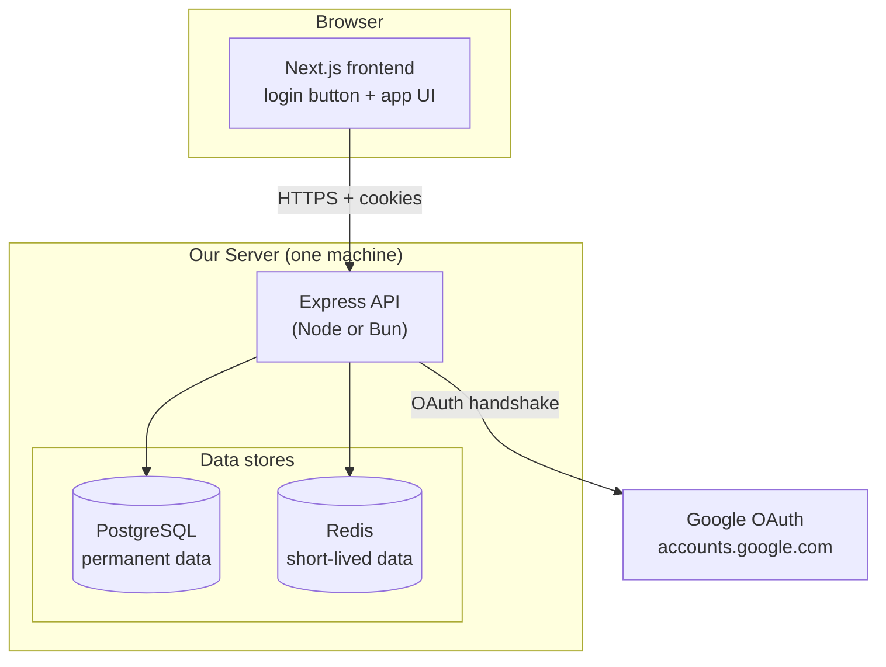

# Chapter 2 — System Architecture

Now that the concepts are clear, let's place them on real components. We're assuming **one capable server** runs everything — no clusters, no load balancers. That keeps the picture simple while still being a correct, production-shaped design.

---

## 2.1 The components



| Component | Role | Holds state? |
|-----------|------|--------------|
| **Next.js frontend** | Renders the login button and the app. Sends cookies automatically. Contains almost **no** auth logic. | No |
| **Express API** | The brain. Runs the OAuth flow, mints tokens, checks every request, manages sessions. | No (logic only) |
| **PostgreSQL** | The **source of truth**: users, their linked Google account, their active sessions, the audit log. | Yes — permanently |
| **Redis** | A fast scratchpad for data that should expire on its own after minutes. | Yes — temporarily |

> **Backend-first, as promised.** The frontend's entire job is: show a button that links to `/api/auth/google/start`, and let the browser carry cookies. Every interesting decision happens in Express. If you understand the Express side, you understand the system.

---

## 2.2 Why two data stores?

A fair beginner question: *we already have PostgreSQL — why add Redis?* Because the two are good at different things, and using the right one keeps us fast and simple.

| | PostgreSQL | Redis |
|---|-----------|-------|
| **What it is** | A relational database on disk | An in-memory key-value store |
| **Best at** | Permanent, structured, related data you query in many ways | Tiny pieces of data you look up by exact key, very fast |
| **Speed** | Fast (~1–10 ms/query) | Very fast (~0.2–1 ms), because it's in RAM |
| **Data survives restart?** | Yes | Yes-ish (optional), but treat it as *disposable* |
| **Auto-expiry?** | No (you write cleanup jobs) | **Yes** — set a TTL and the key deletes itself |

We could build this whole system with *only* PostgreSQL. We add Redis for exactly **one job at first** (the login handshake), because that job is a perfect fit for it. More on that below.

---

## 2.3 Redis, explained from zero

If you've never used Redis, here's the entire mental model you need to start.

**Redis is a giant hash map (dictionary) that lives in your server's RAM.** You store values by a key, and get them back by that key. That's it.

```bash
# Set a key to a value
SET user:42:name "Alice"

# Get it back
GET user:42:name        # -> "Alice"

# Set a key that DELETES ITSELF after 600 seconds
SETEX login:abc123 600 "{...handshake data...}"

# Delete a key now
DEL user:42:name
```

Three things make it special:

1. **It's in memory**, so reads/writes are sub-millisecond. Great for the hot path.
2. **Keys can expire** (`SETEX`, or `SET ... EX 600`). After the TTL, the key vanishes with no cleanup job. Perfect for temporary data.
3. **It's a separate process**, so its data survives your app restarting, and (later, if you scale) multiple app servers can share it.

> **Mental model:** PostgreSQL is your filing cabinet — organized, permanent, searchable. Redis is the sticky note on your monitor — instant to read, and you throw it away after a few minutes.

### Where Redis earns its place here

We use Redis for **the login handshake state** — and that's it, to begin with.

During login (Chapter 3), we generate a `state`, a `nonce`, and a PKCE `code_verifier`. We need to remember these for the ~30 seconds between "user clicks the button" and "Google redirects back." They must:

- be looked up by an exact key (the `state` value),
- disappear automatically if the user abandons login,
- never clutter our permanent database.

That is the textbook Redis use case:

```bash
# When login starts: remember the handshake for 10 minutes
SETEX oauth:state:<state> 600 '{"codeVerifier":"...","nonce":"..."}'

# When Google redirects back: fetch and immediately delete (one-time use)
GET oauth:state:<state>
DEL oauth:state:<state>
```

If the user wanders off, Redis cleans up after itself in 10 minutes. No cron job, no junk rows in PostgreSQL.

### Could we skip Redis entirely?

Yes — you could store the handshake state in a signed cookie or a small Postgres table with an `expires_at` column. We choose Redis because (a) it's the *right* tool, (b) it's a gentle, low-stakes way to learn Redis, and (c) it sets you up for the two other natural Redis jobs you'll want soon:

| Future Redis job | Why Redis | Covered in |
|------------------|-----------|------------|
| **Rate limiting** | Counters with auto-expiry ("max 10 login attempts per IP per minute") | [Chapter 7](./07-security.md) |
| **Access-token denylist** (optional) | Instantly revoke a not-yet-expired access token | [Chapter 4](./04-tokens-and-sessions.md) |

We introduce each only when there's a real reason — never "because Redis is cool."

---

## 2.4 What lives where — the cheat sheet

A quick reference you can come back to. "Who is the source of truth for X?"

| Data | Lives in | Why there |
|------|----------|-----------|
| User record (id, email, name) | **PostgreSQL** | Permanent, queried by id and email |
| Linked Google account (`sub` → user) | **PostgreSQL** | Permanent, enables account linking |
| Active sessions (one per device) | **PostgreSQL** | Permanent, user must see/revoke them |
| Refresh token (hashed) | **PostgreSQL** | Must survive restarts and be revocable |
| Audit log of auth events | **PostgreSQL** | Permanent history |
| Login handshake (`state`, `nonce`, PKCE) | **Redis** | Temporary, auto-expiring, looked up by key |
| Rate-limit counters | **Redis** | Temporary, auto-expiring |
| Our access token | **Nowhere on the server!** | It's a self-verifying JWT in a cookie — see Chapter 4 |

That last row is the punchline of the whole design: **the thing we check on every single request — the access token — requires no server-side storage at all.** That's what keeps us fast.

---

## 2.5 The request, end to end (preview)

To anchor everything, here's the lifecycle we'll build, in plain English:

1. **Login (rare, slow-ish):** browser → Google → our backend → create user + session → set cookies. Touches Google, Postgres, Redis. Happens once per device per month.
2. **Normal request (constant, fast):** browser sends cookie → backend verifies the access-token JWT's signature in memory → done. Touches *nothing* else. This is 99% of traffic.
3. **Token refresh (every ~15 min):** access token expired → browser sends refresh cookie → backend checks it against Postgres, issues a new access token. One indexed DB query.
4. **Logout:** delete the session row, clear cookies.

Notice the shape: the **expensive** work (login) is rare, and the **frequent** work (normal requests) is cheap. Good auth systems are built around that asymmetry — we'll make it explicit in [Chapter 8](./08-performance.md).

**Next:** [Chapter 3 → The Login Flow](./03-login-flow.md)
