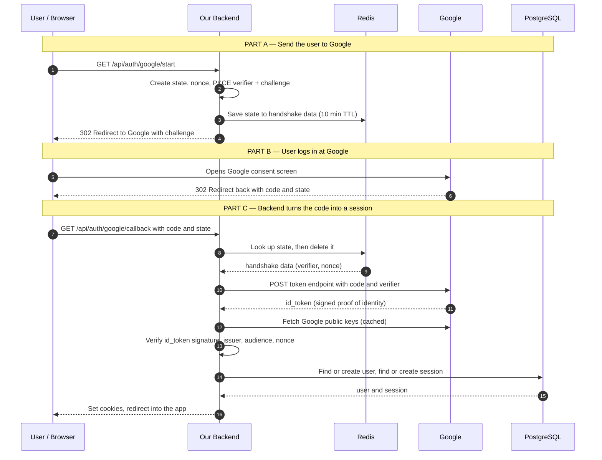

# Chapter 3 — The Login Flow

This is the heart of the guide. We'll walk the **entire** "Sign in with Google" flow once, slowly, end to end — and show the real backend code for the tricky parts. By the end, there should be **zero** mystery about what happens between clicking the button and being logged in.

---

## 3.1 The flow at a glance



Three parts:
- **Part A** — we prepare a handshake and bounce the user to Google.
- **Part B** — Google handles the actual authentication (password, 2FA, consent). We do nothing here.
- **Part C** — Google bounces the user back to us with a code; we redeem it, verify the identity, and create the session.

Let's do each part with code. (Code is TypeScript + Express; it works the same on Bun.)

---

## 3.2 One-time setup: register your app with Google

Before any code runs, you create an OAuth client in the [Google Cloud Console](https://console.cloud.google.com/apis/credentials):

1. Create an **OAuth 2.0 Client ID** of type **Web application**.
2. Add an **Authorized redirect URI**: `https://yourapp.com/api/auth/google/callback` (and a `http://localhost:3000/...` one for dev).
3. Google gives you a **Client ID** and **Client Secret**.

Put them in your environment:

```bash
GOOGLE_CLIENT_ID=xxxxx.apps.googleusercontent.com
GOOGLE_CLIENT_SECRET=xxxxx
GOOGLE_REDIRECT_URI=https://yourapp.com/api/auth/google/callback

# Google's fixed endpoints (from its discovery document)
GOOGLE_AUTH_URL=https://accounts.google.com/o/oauth2/v2/auth
GOOGLE_TOKEN_URL=https://oauth2.googleapis.com/token
GOOGLE_JWKS_URL=https://www.googleapis.com/oauth2/v3/certs
GOOGLE_ISSUER=https://accounts.google.com
```

> The **redirect URI must match exactly** — Google rejects anything not on the allowlist. This is a core anti-phishing protection: an attacker can't point your client at their own site.

---

## 3.3 Part A — Start the flow

When the user clicks "Continue with Google", the browser hits `GET /api/auth/google/start`. The backend prepares the handshake and redirects to Google.

### The PKCE + state helpers (raw `crypto`, no library)

```ts
import crypto from "node:crypto";

// A URL-safe random string — used for state, nonce, and the PKCE verifier.
function randomUrlSafe(bytes = 32): string {
  return crypto.randomBytes(bytes).toString("base64url");
}

// PKCE: the challenge is the SHA-256 hash of the verifier, base64url-encoded.
function pkceChallenge(verifier: string): string {
  return crypto.createHash("sha256").update(verifier).digest("base64url");
}
```

That's the entire PKCE implementation. No SDK needed — it's just a random string and its hash.

### The `/start` handler

```ts
app.get("/api/auth/google/start", async (req, res) => {
  // 1. Generate the three secrets for this login attempt.
  const state = randomUrlSafe();
  const nonce = randomUrlSafe();
  const codeVerifier = randomUrlSafe();
  const codeChallenge = pkceChallenge(codeVerifier);

  // 2. Remember them in Redis, keyed by `state`, for 10 minutes.
  //    We will need the verifier and nonce when Google redirects back.
  await redis.setex(
    `oauth:state:${state}`,
    600,
    JSON.stringify({ codeVerifier, nonce })
  );

  // 3. Build Google's authorization URL.
  const url = new URL(process.env.GOOGLE_AUTH_URL!);
  url.searchParams.set("client_id", process.env.GOOGLE_CLIENT_ID!);
  url.searchParams.set("redirect_uri", process.env.GOOGLE_REDIRECT_URI!);
  url.searchParams.set("response_type", "code");      // Authorization Code flow
  url.searchParams.set("scope", "openid email profile"); // openid => OIDC + identity
  url.searchParams.set("state", state);               // CSRF protection
  url.searchParams.set("nonce", nonce);               // replay protection
  url.searchParams.set("code_challenge", codeChallenge);
  url.searchParams.set("code_challenge_method", "S256");

  // 4. Send the browser to Google.
  res.redirect(url.toString());
});
```

**What just happened:** we created a one-time handshake, stashed its secrets in Redis under the `state` key, and redirected the browser to Google carrying only the *public* parts (`state`, `nonce`, `code_challenge`). The `codeVerifier` never left our server.

---

## 3.4 Part B — Google authenticates the user

Now the user is on Google's domain. Google shows the account picker, may ask for a password or 2FA, and shows the consent screen ("YourApp wants to access your name and email"). **We have no code here — this is entirely Google's job.** That's the whole point: we never touch the password.

When the user approves, Google redirects the browser back to our `redirect_uri`:

```
GET /api/auth/google/callback?code=4/0Ab...&state=<the same state we sent>
```

- `code` — the one-time authorization code.
- `state` — the exact value we generated in Part A. We're about to verify it.

---

## 3.5 Part C — Redeem the code and create the session

This is the most important handler in the system. It has five jobs:

1. Validate the `state` (anti-CSRF).
2. Exchange the `code` for an ID token (the raw token-exchange call).
3. Verify the ID token cryptographically.
4. Find or create the user (and link the Google account).
5. Create a session and set cookies.

### Step 1–2: validate state, exchange the code

```ts
app.get("/api/auth/google/callback", async (req, res) => {
  const { code, state } = req.query as { code?: string; state?: string };
  if (!code || !state) return res.status(400).send("Missing code or state");

  // 1. Look up the handshake by state, and delete it (one-time use).
  //    If it's missing, this is a forged or expired callback -> reject.
  const raw = await redis.getdel(`oauth:state:${state}`);
  if (!raw) return res.status(400).send("Invalid or expired login attempt");
  const { codeVerifier, nonce } = JSON.parse(raw);

  // 2. Exchange the code for tokens — a direct server-to-server POST.
  //    This is the step that uses our client_secret and the PKCE verifier.
  const tokenRes = await fetch(process.env.GOOGLE_TOKEN_URL!, {
    method: "POST",
    headers: { "Content-Type": "application/x-www-form-urlencoded" },
    body: new URLSearchParams({
      code,
      client_id: process.env.GOOGLE_CLIENT_ID!,
      client_secret: process.env.GOOGLE_CLIENT_SECRET!,
      redirect_uri: process.env.GOOGLE_REDIRECT_URI!,
      grant_type: "authorization_code",
      code_verifier: codeVerifier, // PKCE: prove we started this flow
    }),
  });
  if (!tokenRes.ok) return res.status(401).send("Token exchange failed");
  const tokens = await tokenRes.json(); // { id_token, access_token, ... }
```

> Notice we used plain `fetch` and `URLSearchParams`. There is no Google library here — we're speaking the OAuth protocol directly. `getdel` reads and deletes in one atomic step, so a `state` can never be replayed.

### Step 3: verify the ID token

The token response contains an `id_token` — a JWT signed by Google. **We must never trust it blindly.** We verify:

- the **signature** (using Google's public keys),
- the **issuer** (`iss`) is really Google,
- the **audience** (`aud`) is really *our* client ID (not some other app's token),
- the **nonce** matches the one we generated (replay protection).

This is the one place we use `jose` — a generic JWT library — so we don't hand-roll RSA verification.

```ts
import { createRemoteJWKSet, jwtVerify } from "jose";

// Google's public keys, fetched once and cached in memory by `jose`.
// This is why verification is fast: no network call on the hot path.
const googleKeys = createRemoteJWKSet(new URL(process.env.GOOGLE_JWKS_URL!));

  // 3. Verify the id_token. Throws if signature/issuer/audience is wrong.
  const { payload: claims } = await jwtVerify(tokens.id_token, googleKeys, {
    issuer: process.env.GOOGLE_ISSUER,        // must be accounts.google.com
    audience: process.env.GOOGLE_CLIENT_ID,   // must be OUR client id
  });

  // Manually check the nonce — it must match what we stored in Redis.
  if (claims.nonce !== nonce) {
    return res.status(401).send("Nonce mismatch");
  }

  // The claims are now trustworthy. Pull out the identity.
  const googleUser = {
    sub: claims.sub as string,            // Google's stable user id
    email: claims.email as string,
    emailVerified: claims.email_verified as boolean,
    name: claims.name as string | undefined,
    picture: claims.picture as string | undefined,
  };
```

> **`sub` is the identity, not email.** A person's email can change; their Google `sub` never does. We key the account on `sub`. (Why this matters for security is in [Chapter 7](./07-security.md).)

### Step 4–5: find-or-create the user, then create the session

```ts
  // 4. Find or create the user + linked Google account (details in Ch. 5).
  const user = await findOrCreateUserFromGoogle(googleUser);

  // 5. Create a session for THIS device and set the cookies (details in Ch. 4).
  await createSessionAndSetCookies(req, res, user.id);

  // Done — send the user into the app.
  res.redirect("/");
});
```

We'll unfold `findOrCreateUserFromGoogle` in [Chapter 5](./05-database-design.md) and `createSessionAndSetCookies` in [Chapter 4](./04-tokens-and-sessions.md). The flow above is the complete skeleton — everything else is detail hanging off these two calls.

---

## 3.6 The validation gates (memorize these)

A login is only allowed to succeed if **every** gate passes. If you ever debug a "login works but is insecure" bug, it's almost always a missing gate here.

| # | Gate | Stops this attack |
|---|------|-------------------|
| 1 | `state` exists in Redis and matches | Forged callback / CSRF |
| 2 | Code exchange happens server-side with `client_secret` | Stolen code being redeemed elsewhere |
| 3 | PKCE `code_verifier` matches the challenge | Intercepted authorization code |
| 4 | ID token **signature** verifies against Google's keys | Forged/tampered identity token |
| 5 | `iss` is Google, `aud` is our client ID | A token meant for a *different* app being reused here |
| 6 | `nonce` matches | Replaying an old ID token |
| 7 | (Linking) only auto-link if `email_verified` is true | Account takeover via unverified email |

---

## 3.7 What we have at the end

After a successful login, the user's browser holds two HttpOnly cookies (an access token and a refresh token), and our database has:

- a **user** row,
- an **oauth_account** row linking their Google `sub` to that user,
- a **session** row for this specific device.

Everything Google gave us has been used and discarded. From here on, the user is logged into **our** app on **our** tokens.

How those tokens and sessions work is the next chapter.

**Next:** [Chapter 4 → Tokens & Sessions](./04-tokens-and-sessions.md)
