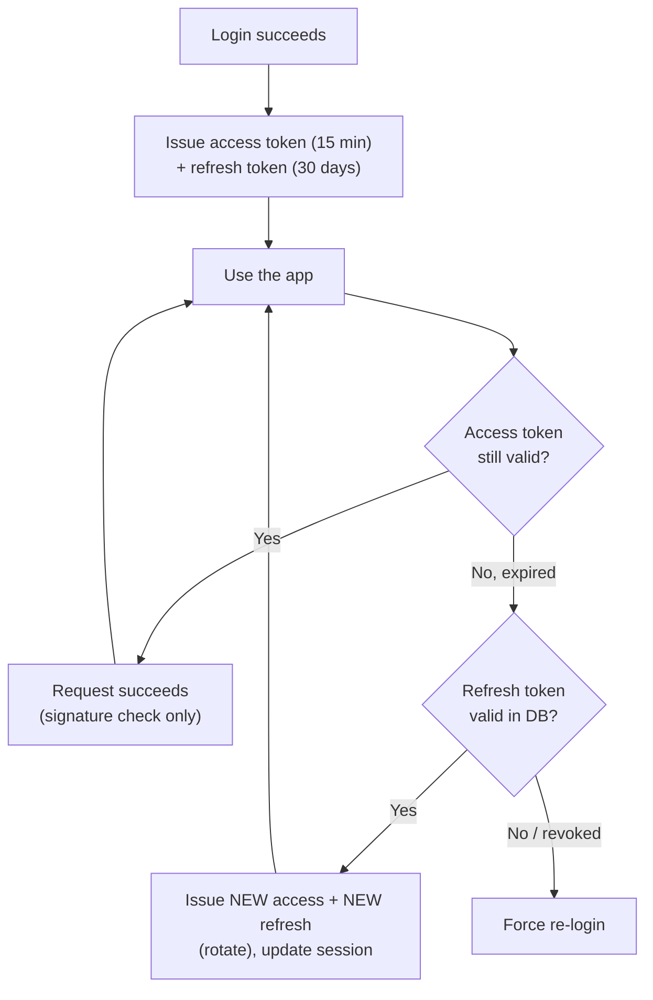

# Chapter 4 — Tokens & Sessions

Login is over. Google has vouched for the user, and now it's *our* job to keep them logged in — securely, across page loads and devices. This chapter explains the two tokens we issue, how they ride in cookies, and how a **session** maps to a single device.

---

## 4.1 Why two tokens?

We issue **two** tokens with opposite trade-offs, and use each for what it's good at.

| | Access token | Refresh token |
|---|--------------|---------------|
| **Job** | Prove "I'm logged in" on every request | Get a new access token when the old one expires |
| **Format** | **JWT** (self-describing, signed) | **Opaque** random string (meaningless without the DB) |
| **Lifetime** | Short — ~15 minutes | Long — ~30 days |
| **Checked by** | Verifying a signature **in memory** (no DB) | Looking it up **in PostgreSQL** |
| **Revocable?** | Not until it expires (so we keep it short) | **Yes, instantly** (delete the DB row) |
| **Sent on** | Every API request | Only when refreshing |

The tension this resolves: we want auth checks to be **fast** (no database hit per request) *and* **revocable** (log someone out immediately). You can't get both from one token. So:

- The **access token** gives us speed: verified by math, no database, expires fast.
- The **refresh token** gives us control: every ~15 minutes it must pass through the database, where we can refuse it.

> **The 15-minute rule of thumb.** A stolen access token is only useful until it expires. Fifteen minutes is the usual balance: short enough to limit damage, long enough that we're not refreshing constantly. The refresh token is the long-lived, *revocable* thing — and it lives safely in an HttpOnly cookie scoped to one endpoint.

---

## 4.2 The token lifecycle



Two loops:
- The **fast loop** (top): a valid access token → request succeeds with just a signature check. This is the common case.
- The **slow loop** (bottom): every ~15 minutes the access token expires, and the refresh token quietly buys a new one from the database.

---

## 4.3 The access token (a JWT we sign)

We sign our own JWTs. For a single backend, we use **HS256** — a symmetric signature with one secret key. (When you eventually have *multiple* independent services that each need to verify tokens, you'd switch to **RS256**, where services hold only a public key. We don't need that yet — see the note at the end.)

```ts
import { SignJWT, jwtVerify } from "jose";

const ACCESS_SECRET = new TextEncoder().encode(process.env.ACCESS_TOKEN_SECRET!);

// Mint a 15-minute access token for a user + their session.
async function signAccessToken(userId: string, sessionId: string) {
  return new SignJWT({ sid: sessionId })
    .setProtectedHeader({ alg: "HS256" })
    .setSubject(userId)                 // sub = user id
    .setIssuer("https://yourapp.com")
    .setAudience("yourapp-web")
    .setIssuedAt()
    .setExpirationTime("15m")
    .sign(ACCESS_SECRET);
}

// Verify it on each request. Throws if expired or tampered. No DB hit.
async function verifyAccessToken(token: string) {
  const { payload } = await jwtVerify(token, ACCESS_SECRET, {
    issuer: "https://yourapp.com",
    audience: "yourapp-web",
  });
  return { userId: payload.sub as string, sessionId: payload.sid as string };
}
```

The claims are deliberately tiny: just `sub` (user id) and `sid` (session id), plus the standard `iss`/`aud`/`exp`. **Keep access tokens small** — they travel on every request. Don't stuff the user's whole profile in there; the app can fetch that separately.

> The `sid` claim ties the access token to a specific session (device). It lets the refresh endpoint know *which* session to renew, and enables optional instant revocation (§4.7).

---

## 4.4 The refresh token (opaque + hashed)

The refresh token is **not** a JWT. It's just a long random string. Why opaque? Because we *want* to look it up in the database every time — that lookup is our revocation point.

Two rules make it safe:

1. **It's random and long** (32 bytes) — unguessable.
2. **We store only its hash**, never the token itself. If our database leaks, the stolen hashes are useless (you can't reverse SHA-256). This is the same reason you hash passwords.

```ts
import crypto from "node:crypto";

function newRefreshToken(): string {
  return crypto.randomBytes(32).toString("base64url"); // the value sent to the browser
}

function hashToken(token: string): string {
  return crypto.createHash("sha256").update(token).digest("hex"); // what we store
}
```

The browser holds the real token (in a cookie); the database holds only `sha256(token)`. On refresh, we hash the incoming token and look for a matching row.

---

## 4.5 A session *is* a device

Here's the model that gives you "log out my old phone": **every login on every device creates one `session` row.** The session is the home of that device's refresh token and its fingerprint.

When we create a session, we record what we can observe about the device from the request:

| Field | Where it comes from | Example |
|-------|--------------------|---------|
| `ip_address` | The request's source IP | `203.0.113.7` |
| `user_agent` | The `User-Agent` header | `Mozilla/5.0 (iPhone...)` |
| `device` | Parsed from the user agent | `iPhone` |
| `os` | Parsed from the user agent | `iOS 17` |
| `browser` | Parsed from the user agent | `Safari` |

Parsing the user agent into friendly names is the one place a tiny helper library is worth it (e.g. `ua-parser-js`) — it's not auth-related, just string parsing. The point is to show the user a readable list:

> *"You're signed in on: iPhone · Safari · Mumbai · last active 2 min ago — and MacBook · Chrome · last active yesterday."*

### Creating the session and setting cookies

This is the `createSessionAndSetCookies` we deferred from Chapter 3.

```ts
import { UAParser } from "ua-parser-js"; // optional: parses the User-Agent string

async function createSessionAndSetCookies(req, res, userId: string) {
  // 1. Generate this device's refresh token (and remember its hash).
  const refreshToken = newRefreshToken();

  // 2. Parse the device fingerprint from the request.
  const ua = new UAParser(req.headers["user-agent"]).getResult();

  // 3. Create the session row (one per device).
  const session = await db.session.create({
    data: {
      userId,
      refreshTokenHash: hashToken(refreshToken),
      ipAddress: req.ip,
      userAgent: req.headers["user-agent"] ?? "",
      device: ua.device.model ?? ua.device.type ?? "Unknown",
      os: [ua.os.name, ua.os.version].filter(Boolean).join(" "),
      browser: ua.browser.name ?? "Unknown",
      expiresAt: new Date(Date.now() + 30 * 24 * 60 * 60 * 1000), // 30 days
    },
  });

  // 4. Mint the matching access token (carries this session's id).
  const accessToken = await signAccessToken(userId, session.id);

  // 5. Set both as HttpOnly cookies.
  setAuthCookies(res, accessToken, refreshToken);

  // 6. Record the login in the audit log (Chapter 5).
  await logAuthEvent(userId, "login", req);
}
```

---

## 4.6 The cookies (where the tokens actually live)

The browser never reads the tokens. They live in **HttpOnly** cookies — invisible to JavaScript, so an XSS bug can't steal them.

```ts
function setAuthCookies(res, accessToken: string, refreshToken: string) {
  // Access token: sent on every request to the app.
  res.cookie("access_token", accessToken, {
    httpOnly: true,   // JavaScript cannot read it -> safe from XSS
    secure: true,     // HTTPS only
    sameSite: "lax",  // not sent on cross-site requests -> CSRF defense
    path: "/",
    maxAge: 15 * 60 * 1000, // 15 minutes
  });

  // Refresh token: only ever sent to the refresh endpoint.
  res.cookie("refresh_token", refreshToken, {
    httpOnly: true,
    secure: true,
    sameSite: "lax",
    path: "/api/auth/refresh", // scoped! the browser won't send it anywhere else
    maxAge: 30 * 24 * 60 * 60 * 1000, // 30 days
  });
}
```

Two details that punch above their weight:

- **`path: "/api/auth/refresh"`** on the refresh cookie means the browser only attaches it to that one endpoint. Your normal API requests never even carry the long-lived token — less exposure.
- **`sameSite: "lax"`** means the cookie isn't sent on requests *originating from other sites*, which neutralizes most CSRF. (Chapter 7 covers the remaining edge with a CSRF token.)

> **API clients (mobile/third-party).** Cookies are perfect for the browser. A native app or script instead reads the tokens from the JSON response and sends the access token as `Authorization: Bearer <token>`. Our auth middleware accepts **either** — cookie *or* Bearer header — so the same backend serves both. See [Chapter 6](./06-api-design.md).

---

## 4.7 Checking auth on every request (the middleware)

This little function runs on protected routes. It's the **hot path** — the code that decides "logged in?" thousands of times. Notice it touches **no database**.

```ts
async function requireAuth(req, res, next) {
  // Accept the token from the cookie (browser) or the Authorization header (API).
  const token =
    req.cookies?.access_token ??
    req.headers.authorization?.replace("Bearer ", "");

  if (!token) return res.status(401).json({ error: "Not authenticated" });

  try {
    const { userId, sessionId } = await verifyAccessToken(token); // signature only
    req.user = { id: userId, sessionId };
    next();
  } catch {
    // Expired or invalid -> client should hit /api/auth/refresh and retry.
    return res.status(401).json({ error: "Token expired" });
  }
}
```

That `verifyAccessToken` call is pure math on data already in the request — typically **well under a millisecond**. This single design choice is the reason authenticated requests stay under 100 ms ([Chapter 8](./08-performance.md)).

### Optional: instant access-token revocation

Stateless access tokens have one downside: if you ban a user, their current access token still works for up to 15 minutes. Usually fine. If you need *instant* kill, add a Redis denylist: on logout/ban, write the `sid` to Redis with a 15-minute TTL, and have `requireAuth` reject any token whose `sid` is denylisted. It's one extra Redis read — add it only if you actually need sub-15-minute revocation.

---

## 4.8 Refreshing (with rotation)

When the access token expires, the browser automatically sends the refresh cookie to `/api/auth/refresh`. We look up the session, issue a new access token, and **rotate** the refresh token (issue a new one, invalidate the old).

```ts
app.post("/api/auth/refresh", async (req, res) => {
  const presented = req.cookies?.refresh_token;
  if (!presented) return res.status(401).json({ error: "No refresh token" });

  // 1. Look up the session by the HASH of the presented token. (Indexed -> fast.)
  const session = await db.session.findUnique({
    where: { refreshTokenHash: hashToken(presented) },
  });

  // 2. Reject if missing, revoked, or expired.
  if (!session || session.revokedAt || session.expiresAt < new Date()) {
    return res.status(401).json({ error: "Invalid refresh token" });
  }

  // 3. ROTATE: issue a brand-new refresh token and replace the stored hash.
  const newRefresh = newRefreshToken();
  await db.session.update({
    where: { id: session.id },
    data: {
      refreshTokenHash: hashToken(newRefresh),
      lastUsedAt: new Date(),
    },
  });

  // 4. Issue a fresh access token and set both cookies again.
  const newAccess = await signAccessToken(session.userId, session.id);
  setAuthCookies(res, newAccess, newRefresh);

  res.json({ ok: true });
});
```

### Why rotate?

**Rotation** = every time a refresh token is used, it's replaced. This means a refresh token is a **single-use** ticket. The payoff is **theft detection**: if a token is ever used *twice*, you know something is wrong — the legitimate use rotated it away, so a second use means a copy is loose. The hardened response (revoke the whole session on reuse) is covered in [Chapter 7](./07-security.md); the schema that enables it is in [Chapter 5](./05-database-design.md).

---

## 4.9 Logout

- **Log out this device:** delete (or mark revoked) the one session row, clear the cookies.
- **Log out everywhere:** delete all session rows for the user.

```ts
app.post("/api/auth/logout", requireAuth, async (req, res) => {
  await db.session.deleteMany({ where: { id: req.user.sessionId } });
  res.clearCookie("access_token", { path: "/" });
  res.clearCookie("refresh_token", { path: "/api/auth/refresh" });
  await logAuthEvent(req.user.id, "logout", req);
  res.json({ ok: true });
});
```

Because sessions are per-device, "log out my old phone" is just deleting that phone's session row — the user's other devices are untouched. That's the whole reason we modeled a session as a device.

---

## 4.10 "Session families" — what people mean

You'll hear the term **session family**. It refers to the *chain of rotated refresh tokens that all descend from one original login*. Token #1 rotates into #2 rotates into #3 — same session, same device, one family. The concept matters for theft detection: if an *old* member of the family reappears after it was rotated away, the family is compromised and we kill the whole session. In our model, the `session` row **is** the family (it holds the current token in the chain), which keeps things simple. Chapter 7 shows the optional reuse-detection upgrade.

> **One sentence to keep:** access tokens are fast but dumb; refresh tokens are slow but smart; sessions are devices; rotation turns theft into a detectable event.

**Next:** [Chapter 5 → Database Design](./05-database-design.md)
