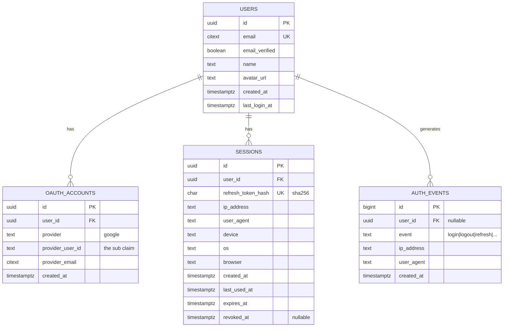

# Chapter 5 — Database Design

Four tables run this entire system. This chapter shows the schema, *why* it's split the way it is, how **account linking** works, and the **audit log** decision. The design is deliberately small — you can hold all of it in your head.

---

## 5.1 The schema at a glance



| Table | One row = | Purpose |
|-------|-----------|---------|
| `users` | one human | The person, independent of how they log in |
| `oauth_accounts` | one external identity | "This Google account belongs to this user" |
| `sessions` | one logged-in device | Holds the refresh token + device info |
| `auth_events` | one security-relevant action | The audit log (optional but recommended) |

---

## 5.2 Why `users` and `oauth_accounts` are separate

This is the single most important modeling decision, and it's worth understanding even though we only have Google today.

A **user is a person**. A **Google account is one way that person proves who they are.** They are not the same thing — so they get separate tables.

Why not just put `google_id` on the `users` table? Because the day you add "Sign in with Microsoft" (or GitHub, or Apple), one person will have *two* external identities pointing at *one* account. A separate `oauth_accounts` table models that cleanly:

```
users(id=1, email=alice@gmail.com)
  └── oauth_accounts(provider=google,    provider_user_id=G-abc)
  └── oauth_accounts(provider=microsoft, provider_user_id=M-xyz)   <- added later
```

By splitting now, **adding a provider later is a new row, not a migration of your user table.** This is what "the design leaves room for Microsoft" meant in the README — it costs us nothing today and saves a painful refactor tomorrow.

The **unique key is `(provider, provider_user_id)`** — the combination of "which provider" and "their stable id for this user." We key on `provider_user_id` (Google's `sub`), **not email**, because:

- A `sub` is permanent; an email can be changed or reassigned.
- Keying on email invites account-takeover bugs (Chapter 7).

---

## 5.3 Find-or-create + account linking

This is the `findOrCreateUserFromGoogle` we deferred from Chapter 3. It encodes the linking policy. Read the comments — the *order* of these checks is a security decision.

```ts
async function findOrCreateUserFromGoogle(g: {
  sub: string; email: string; emailVerified: boolean;
  name?: string; picture?: string;
}) {
  // CASE 1 — Returning user: we've seen this exact Google account before.
  const existing = await db.oauthAccount.findUnique({
    where: { provider_providerUserId: { provider: "google", providerUserId: g.sub } },
    include: { user: true },
  });
  if (existing) return existing.user;

  // From here, it's a Google account we've never seen. Two sub-cases:

  // CASE 2 — Link to an existing user with the same VERIFIED email.
  //   Only auto-link when Google says the email is verified, otherwise an
  //   attacker could create a Google account with someone else's email.
  if (g.emailVerified) {
    const sameEmailUser = await db.user.findUnique({ where: { email: g.email } });
    if (sameEmailUser) {
      await db.oauthAccount.create({
        data: {
          userId: sameEmailUser.id,
          provider: "google",
          providerUserId: g.sub,
          providerEmail: g.email,
        },
      });
      return sameEmailUser;
    }
  }

  // CASE 3 — Brand-new user: create the user AND the linked account together.
  return db.user.create({
    data: {
      email: g.email,
      emailVerified: g.emailVerified,
      name: g.name,
      avatarUrl: g.picture,
      lastLoginAt: new Date(),
      accounts: {
        create: {
          provider: "google",
          providerUserId: g.sub,
          providerEmail: g.email,
        },
      },
    },
  });
}
```

The three cases:

| Case | Situation | Action |
|------|-----------|--------|
| 1 | Known Google account | Log the existing user in |
| 2 | New Google account, but email matches an existing user (and is verified) | **Link** it to that user |
| 3 | New Google account, new email | Create a fresh user + account |

> **Manual linking** (a logged-in user adding a second provider on purpose) uses the same `oauthAccount.create`, just triggered from a "Connect account" button while already authenticated. The endpoint for it is in [Chapter 6](./06-api-design.md).

---

## 5.4 The `sessions` table = devices

We covered the *why* in Chapter 4; here's the table's role in the data model. Each row is one device's login, and it carries:

- `refresh_token_hash` — **unique index**, because every refresh looks the session up by this. The index is what makes refresh fast.
- the **device fingerprint** (`ip_address`, `user_agent`, `device`, `os`, `browser`) — so the user can recognize and revoke devices.
- `expires_at` and `revoked_at` — the two ways a session ends.

"Show my active sessions" is then a trivial query:

```ts
db.session.findMany({
  where: { userId, revokedAt: null, expiresAt: { gt: new Date() } },
  orderBy: { lastUsedAt: "desc" },
});
```

Expired/revoked rows are swept by a nightly job (delete where `expires_at < now()` or `revoked_at is not null`). Nothing fancy — a single `DELETE`.

---

## 5.5 The audit log — and why I kept it

You asked me to decide whether **auditability** is worth learning. **My recommendation: yes, include the light version.** Here's the honest reasoning.

**What an audit log is:** a simple, append-only list of security-relevant events — *who* did *what*, *when*, and *from where*. We never update or delete rows; we only add. Our version is one tiny table, `auth_events`, with a handful of columns.

**Why it's worth it, even for a beginner project:**

1. **It answers "was I hacked?"** When a user (or you) gets nervous, "show me the last 20 logins with their IPs and devices" is the first question. Without an audit log, you simply cannot answer it — the data was never recorded.
2. **It powers a real product feature.** "Recent security activity" / "your login history" — the screen every serious app has — *is* this table.
3. **It's nearly free.** One `INSERT` on login/logout/refresh-failure. No complexity, no performance cost (it's off the hot path and can even be fire-and-forget).
4. **It teaches a durable habit.** "Record security events" is something every backend engineer is expected to do. Learning it on a small project is the cheapest time to learn it.

**What I deliberately left OUT** (so it stays a beginner feature, not enterprise compliance): tamper-proof/immutable storage, log shipping to a SIEM, retention policies, PII scrubbing pipelines. Those matter at a company with auditors — not here. If you ever need them, this table is the seed they grow from.

```ts
// Fire-and-forget: never let logging block or break a login.
async function logAuthEvent(userId: string | null, event: string, req) {
  try {
    await db.authEvent.create({
      data: {
        userId,
        event,                                  // "login" | "logout" | "refresh_failed" | ...
        ipAddress: req.ip,
        userAgent: req.headers["user-agent"] ?? "",
      },
    });
  } catch {
    /* swallow — auditing must never break the request */
  }
}
```

> **Verdict:** keep it. It's the highest value-to-effort feature in the whole auth system, and it's the kind of thing whose absence you only notice at the worst possible moment.

---

## 5.6 The Prisma schema

The whole data layer in one file. (Swap to Drizzle if you prefer raw SQL — the tables are identical.)

```prisma
model User {
  id            String         @id @default(uuid()) @db.Uuid
  email         String         @unique @db.Citext
  emailVerified Boolean        @default(false)
  name          String?
  avatarUrl     String?
  createdAt     DateTime       @default(now())
  lastLoginAt   DateTime?

  accounts      OAuthAccount[]
  sessions      Session[]
  authEvents    AuthEvent[]

  @@map("users")
}

model OAuthAccount {
  id             String   @id @default(uuid()) @db.Uuid
  userId         String   @db.Uuid
  provider       String   // "google" (room for "microsoft", "github", ...)
  providerUserId String   // the provider's stable user id (Google's `sub`)
  providerEmail  String?  @db.Citext
  createdAt      DateTime @default(now())

  user           User     @relation(fields: [userId], references: [id], onDelete: Cascade)

  @@unique([provider, providerUserId]) // the real identity key
  @@index([userId])
  @@map("oauth_accounts")
}

model Session {
  id               String    @id @default(uuid()) @db.Uuid
  userId           String    @db.Uuid
  refreshTokenHash String    @unique          // looked up on every refresh
  ipAddress        String?
  userAgent        String?
  device           String?
  os               String?
  browser          String?
  createdAt        DateTime  @default(now())
  lastUsedAt       DateTime  @default(now())
  expiresAt        DateTime
  revokedAt        DateTime?

  user             User      @relation(fields: [userId], references: [id], onDelete: Cascade)

  @@index([userId])
  @@map("sessions")
}

model AuthEvent {
  id        BigInt   @id @default(autoincrement())
  userId    String?  @db.Uuid
  event     String   // "login" | "logout" | "refresh" | "refresh_failed" | ...
  ipAddress String?
  userAgent String?
  createdAt DateTime @default(now())

  user      User?    @relation(fields: [userId], references: [id], onDelete: SetNull)

  @@index([userId, createdAt])
  @@map("auth_events")
}
```

### The indexes that matter (and why)

Indexes are where "database design" meets "performance." Three earn their keep:

| Index | Used by | Without it |
|-------|---------|-----------|
| `sessions.refresh_token_hash` (unique) | Every token refresh | Full table scan every 15 min per user — death |
| `oauth_accounts (provider, provider_user_id)` (unique) | Every login | Slow login + duplicate-account bugs |
| `users.email` (unique) | Login linking, signup | Slow lookups + duplicate users |

> A unique index does double duty: it makes the lookup O(log n) *and* enforces correctness (no two sessions share a token, no two users share an email). Chapter 8 measures what these buy you.

---

## 5.7 What we intentionally didn't model

To keep the surface small and the learning focused:

- **No roles/permissions table.** RBAC is a separate concern; add a `roles` table and a `user_roles` join when you actually have admins. The `users` table is ready for it.
- **No separate `refresh_tokens` table.** We fold the current refresh token into the `session` row (one device = one current token). If you later need full rotation history for forensic theft-detection, promote it to its own table — the upgrade path is in [Chapter 7](./07-security.md).
- **Sessions are stored only in PostgreSQL**, not duplicated in Redis. With one server and indexed lookups, Postgres is plenty fast (Chapter 8). Caching sessions in Redis is a scaling optimization we're correctly *not* doing yet.

**Next:** [Chapter 6 → API Design](./06-api-design.md)
