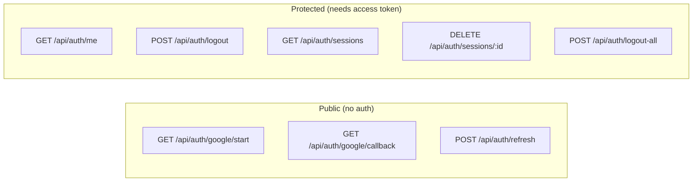
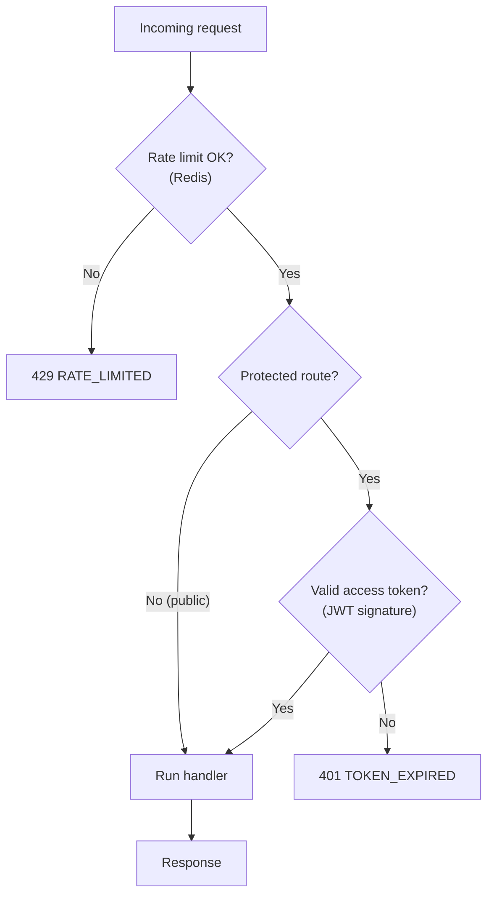

# Chapter 6 — API Design

This is the backend-first chapter. We'll specify **every** auth endpoint precisely: the method, the request, the response, the status codes, and the rules. If Chapters 3–5 were *how it works*, this is *the contract* you'd hand another engineer (or your future self) to build against.

---

## 6.1 Design principles

A few conventions, applied consistently across every endpoint:

| Principle | What it means here |
|-----------|--------------------|
| **REST-ish & predictable** | Resources under `/api/auth/*`. `GET` reads, `POST` changes state. |
| **Cookies for browsers, Bearer for clients** | Browser auth via HttpOnly cookies; API clients send `Authorization: Bearer`. The backend accepts both. |
| **Stateless where possible** | The common request authenticates by JWT signature — no session lookup. |
| **One error shape** | Every error is `{ "error": { "code": "...", "message": "..." } }`. |
| **Correct status codes** | `401` = not authenticated, `403` = authenticated but not allowed, `400` = bad input, `429` = rate-limited. |
| **Never leak secrets** | Tokens go in `Set-Cookie` or the body for API clients — never in URLs, never in logs. |

### The standard error shape

```json
{
  "error": {
    "code": "TOKEN_EXPIRED",
    "message": "Access token has expired. Refresh and retry."
  }
}
```

A small, fixed set of codes the frontend can branch on:

| HTTP | `code` | Meaning |
|------|--------|---------|
| 400 | `INVALID_REQUEST` | Missing/malformed parameters |
| 401 | `NOT_AUTHENTICATED` | No valid credentials |
| 401 | `TOKEN_EXPIRED` | Access token expired — hit `/refresh` |
| 401 | `INVALID_REFRESH` | Refresh token missing/expired/revoked — re-login |
| 403 | `FORBIDDEN` | Authenticated but not allowed |
| 429 | `RATE_LIMITED` | Too many attempts — back off |

---

## 6.2 The endpoint map



| # | Method | Path | Auth | Purpose |
|---|--------|------|------|---------|
| 1 | `GET` | `/api/auth/google/start` | Public | Begin login — redirect to Google |
| 2 | `GET` | `/api/auth/google/callback` | Public¹ | Finish login — set cookies |
| 3 | `POST` | `/api/auth/refresh` | Refresh cookie | Get a new access token |
| 4 | `GET` | `/api/auth/me` | Access token | Who am I? |
| 5 | `POST` | `/api/auth/logout` | Access token | Log out this device |
| 6 | `GET` | `/api/auth/sessions` | Access token | List my devices |
| 7 | `DELETE` | `/api/auth/sessions/:id` | Access token | Revoke one device |
| 8 | `POST` | `/api/auth/logout-all` | Access token | Log out everywhere |

¹ The callback is "public" but self-protects via the `state` it validates against Redis.

---

## 6.3 Endpoint reference

### 1. `GET /api/auth/google/start`

Begins the login. Generates the handshake (Chapter 3) and redirects to Google.

```http
GET /api/auth/google/start
```

**Response**

```http
302 Found
Location: https://accounts.google.com/o/oauth2/v2/auth?client_id=...&state=...
```

- No request body. The frontend's login button is literally `<a href="/api/auth/google/start">`.
- Optional: accept a `?returnTo=/dashboard` query so you can send the user back where they started. **Validate it against an allowlist** (only same-site relative paths) to prevent open-redirect attacks (Chapter 7).

---

### 2. `GET /api/auth/google/callback`

Google redirects here. Validates `state`, exchanges the code, verifies identity, creates the session, sets cookies (full logic in Chapter 3).

```http
GET /api/auth/google/callback?code=4/0Ab...&state=xY9...
```

**Success**

```http
302 Found
Location: /
Set-Cookie: access_token=eyJ...; HttpOnly; Secure; SameSite=Lax; Path=/; Max-Age=900
Set-Cookie: refresh_token=q7F...; HttpOnly; Secure; SameSite=Lax; Path=/api/auth/refresh; Max-Age=2592000
```

**Failure** (bad/expired `state`, token exchange fails, signature invalid)

```http
302 Found
Location: /login?error=auth_failed
```

> We redirect to a friendly error page rather than dumping a JSON 400 at the user — this endpoint is hit by a browser navigation, not an API client.

---

### 3. `POST /api/auth/refresh`

Exchanges a valid refresh token for a new access token, rotating the refresh token (Chapter 4).

```http
POST /api/auth/refresh
Cookie: refresh_token=q7F...
```

**Success**

```http
200 OK
Set-Cookie: access_token=eyJ...(new); ...
Set-Cookie: refresh_token=k2M...(new, rotated); ...

{ "ok": true }
```

**Failure**

```http
401 Unauthorized
{ "error": { "code": "INVALID_REFRESH", "message": "Please sign in again." } }
```

- This is the **only** endpoint the refresh cookie is sent to (it's path-scoped).
- API clients (no cookies) send the refresh token in the body and read the new tokens from the JSON response instead of cookies:

```jsonc
// API-client variant
// Request body:  { "refreshToken": "q7F..." }
// Response body: { "accessToken": "eyJ...", "refreshToken": "k2M..." }
```

---

### 4. `GET /api/auth/me`

Returns the current user. The frontend calls this on load to render "logged in as…". Runs behind `requireAuth` (Chapter 4).

```http
GET /api/auth/me
Cookie: access_token=eyJ...
```

**Success**

```http
200 OK
{
  "id": "9b1c...",
  "email": "alice@gmail.com",
  "name": "Alice",
  "avatarUrl": "https://lh3.googleusercontent.com/...",
  "linkedProviders": ["google"]
}
```

**Not authenticated**

```http
401 Unauthorized
{ "error": { "code": "TOKEN_EXPIRED", "message": "Refresh and retry." } }
```

> The client's rule: on `401 TOKEN_EXPIRED`, silently call `/refresh` once, then retry the original request. If `/refresh` also fails, redirect to login. This retry loop is the entire "stay logged in" UX.

---

### 5. `POST /api/auth/logout`

Ends the current device's session and clears its cookies (Chapter 4).

```http
POST /api/auth/logout
Cookie: access_token=eyJ...
```

**Response**

```http
200 OK
Set-Cookie: access_token=; Max-Age=0
Set-Cookie: refresh_token=; Max-Age=0; Path=/api/auth/refresh
{ "ok": true }
```

---

### 6. `GET /api/auth/sessions`

Lists the user's active devices — powers the "Where you're signed in" screen.

```http
GET /api/auth/sessions
```

**Response**

```http
200 OK
{
  "sessions": [
    {
      "id": "s_1a2b",
      "device": "iPhone", "os": "iOS 17", "browser": "Safari",
      "ipAddress": "203.0.113.7",
      "lastUsedAt": "2026-06-06T10:31:00Z",
      "current": true
    },
    {
      "id": "s_9z8y",
      "device": "MacBook", "os": "macOS 14", "browser": "Chrome",
      "ipAddress": "198.51.100.4",
      "lastUsedAt": "2026-06-05T22:10:00Z",
      "current": false
    }
  ]
}
```

- `current: true` marks the session whose `id` equals the access token's `sid` claim — so the UI can label "This device."

---

### 7. `DELETE /api/auth/sessions/:id`

Revokes one specific device (e.g. "Sign out my old phone").

```http
DELETE /api/auth/sessions/s_9z8y
```

**Response**

```http
200 OK
{ "ok": true }
```

- **Authorization check:** the session must belong to the calling user. Revoking someone else's session must return `404` (not `403`) so you don't leak that the id exists.

```ts
app.delete("/api/auth/sessions/:id", requireAuth, async (req, res) => {
  const result = await db.session.deleteMany({
    where: { id: req.params.id, userId: req.user.id }, // scoped to the caller
  });
  if (result.count === 0)
    return res.status(404).json({ error: { code: "NOT_FOUND", message: "No such session" } });
  await logAuthEvent(req.user.id, "session_revoked", req);
  res.json({ ok: true });
});
```

---

### 8. `POST /api/auth/logout-all`

Revokes every session for the user (the "I lost my laptop" button).

```http
POST /api/auth/logout-all
```

**Response**

```http
200 OK
{ "ok": true, "revoked": 3 }
```

```ts
app.post("/api/auth/logout-all", requireAuth, async (req, res) => {
  const { count } = await db.session.deleteMany({ where: { userId: req.user.id } });
  res.clearCookie("access_token", { path: "/" });
  res.clearCookie("refresh_token", { path: "/api/auth/refresh" });
  await logAuthEvent(req.user.id, "logout_all", req);
  res.json({ ok: true, revoked: count });
});
```

---

## 6.4 Account linking endpoints (future providers)

The schema already supports multiple providers (Chapter 5). When you add Microsoft, you add a parallel pair of routes plus one linking endpoint — no change to existing tables:

| Method | Path | Purpose |
|--------|------|---------|
| `GET` | `/api/auth/:provider/start` | Generalize `google/start` to any provider |
| `GET` | `/api/auth/:provider/callback` | Generalize the callback |
| `POST` | `/api/auth/link/:provider` | While **logged in**, connect another provider to this account |
| `DELETE` | `/api/auth/link/:provider` | Disconnect a provider (block if it's the only login method left) |

> **Guard rail:** never let a user unlink their *last* login method, or they'll lock themselves out. Check `count(oauth_accounts) > 1` before allowing a disconnect.

---

## 6.5 How a request flows through the backend

Putting the middleware order on one page — this is the backend's request pipeline:



The order matters: **rate-limit first** (cheap, protects everything), **then authenticate**, **then** run the handler. Authentication is a signature check — no database — so even protected routes stay fast.

---

## 6.6 The contract, summarized

- **Public:** `start`, `callback`, `refresh`.
- **Protected (access token):** `me`, `logout`, `sessions`, `sessions/:id`, `logout-all`.
- **Browser** uses cookies; **API clients** use `Authorization: Bearer` + JSON token bodies. Same endpoints, both work.
- **Errors** always look like `{ error: { code, message } }`, with honest status codes.
- The frontend's only real logic: on `401 TOKEN_EXPIRED`, call `/refresh` once and retry.

That's a complete, professional auth API. Now let's make sure it's safe.

**Next:** [Chapter 7 → Security](./07-security.md)
