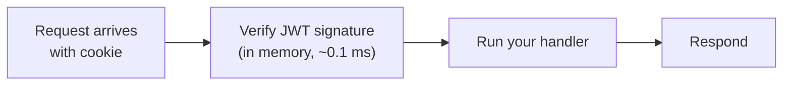

# Chapter 8 — Performance

Your stated goal: keep things fast — the **sub-100 ms / sub-250 ms** numbers you hear about in interviews. This chapter explains where those numbers come from, *why* our design already hits them, and the handful of knobs that keep it that way. You'll also get the vocabulary (p50, p95, p99, "the hot path") to talk about it like a backend engineer.

---

## 8.1 First, what "100 ms" actually means

When someone says "auth should be under 100 ms," they're almost never talking about *login*. They're talking about the **authenticated request** — the check that runs on every API call after you're logged in. Be precise about which operation you mean:

| Operation | How often | Realistic target | Why |
|-----------|-----------|------------------|-----|
| **Authenticated API request** (verify token) | Constant — every request | **< 100 ms** (the auth part: < 1 ms) | This is the hot path; it must be cheap |
| **Token refresh** | Every ~15 min per device | < 100 ms | One indexed DB query |
| **Login (full OAuth)** | Once per device per month | < 1–2 **seconds** is fine | Dominated by network round-trips to Google, which you don't control |

> **The interview trap:** if you try to "optimize login to 50 ms," you've misunderstood the problem — login talks to Google over the internet two or three times; it's *inherently* hundreds of milliseconds and that's completely fine because it's rare. You optimize the **frequent** thing, not the **slow** thing.

---

## 8.2 p50, p95, p99 — say it right

Averages lie. One slow request hidden behind a thousand fast ones disappears in an average but ruins someone's experience. So we measure **percentiles**:

- **p50 (median)** — half of requests are faster than this. The "typical" experience.
- **p95** — 95% are faster; the slowest 1-in-20.
- **p99** — 99% are faster; the slowest 1-in-100. This is where pain hides.

> If p50 is 20 ms but p99 is 900 ms, then **1 in 100 requests is awful** — and a user making 100 requests hits that almost every session. "Fast on average" is not fast. Big-tech latency targets are almost always stated as **p99** for exactly this reason.

What causes a bad p99 in an auth system? A surprise database query on the hot path, a cold cache, a connection-pool stall, or a slow external call you forgot was there. Our design avoids the first by **not touching the database on normal requests at all.**

---

## 8.3 Why our hot path is already fast

Here's the whole cost of an authenticated request in our design:



The auth step is **`verifyAccessToken`** — a cryptographic signature check on bytes already in memory. **No database. No Redis. No network.** That's why it's sub-millisecond.

Contrast it with the design we *didn't* choose — opaque session tokens looked up in the database on every request:

| Approach | Per-request cost | p99 risk |
|----------|------------------|----------|
| **JWT signature check (ours)** | ~0.1 ms, in memory | Very low — no external dependency |
| Opaque token + DB lookup every request | ~1–10 ms + pool contention | DB hiccup spikes *every* request's p99 |

This is the single most important performance decision in the whole guide, and we made it back in Chapter 4: **verify by signature, not by database.** Stateless access tokens mean the common case never leaves the CPU.

> **The trade-off, stated honestly:** the price of skipping the DB lookup is that we can't instantly revoke an access token — it stays valid until it expires. We pay that bill by keeping access tokens short (15 min) and putting revocation on the *refresh* path. That's the textbook stateless-auth bargain.

---

## 8.4 Where the milliseconds actually go

A realistic budget for each operation, so you know what "normal" looks like and can spot when something's wrong:

**Authenticated request (the hot path)**

| Step | Time |
|------|------|
| Parse cookie / header | ~0.05 ms |
| Verify JWT signature | ~0.1 ms |
| Your business logic + its DB queries | the rest of your budget |
| **Auth overhead total** | **< 1 ms** |

Auth is a rounding error. Your 100 ms budget is spent almost entirely on *your* feature's work, not on auth. That's the goal.

**Token refresh**

| Step | Time |
|------|------|
| Hash the presented token (SHA-256) | ~0.02 ms |
| `SELECT session WHERE refresh_token_hash = ?` (**indexed**) | ~1–5 ms |
| `UPDATE` rotated token | ~1–5 ms |
| Sign new access token | ~0.2 ms |
| **Total** | **~5–10 ms** |

**Login (rare, network-bound)**

| Step | Time |
|------|------|
| Redis read/write for handshake | ~1 ms |
| **POST to Google token endpoint** | **100–400 ms** (internet) |
| Verify ID token (keys cached) | ~0.5 ms |
| DB: find-or-create user + session | ~5–15 ms |
| **Total** | **~150–500 ms** — fine, it's once a month |

Notice the pattern: the *only* big numbers are the calls to Google, and those only happen at login.

---

## 8.5 The knobs that keep it fast

You don't need clever tricks — you need to not make the three classic mistakes. Each maps to something we already did.

### 1. Index every lookup column (already done)

Every column we search by is indexed (Chapter 5): `sessions.refresh_token_hash`, `oauth_accounts(provider, provider_user_id)`, `users.email`. Without these, lookups become full table scans that get *linearly slower as you grow* — fast in dev, a disaster in production.

```
SELECT ... WHERE refresh_token_hash = ?
  with index:    ~1 ms,  flat as the table grows   ✅
  without index: scans every row, grows with users ❌
```

> This is *the* fundamental scaling law we keep even though we're ignoring 10M-user concerns: **indexed lookups stay fast; unindexed ones rot.** It costs one line in the schema.

### 2. Pool your database connections

Opening a fresh PostgreSQL connection per request costs ~5–20 ms and exhausts the database. A **connection pool** keeps a handful of connections open and reuses them — turning that 5–20 ms into ~0 ms. Prisma pools by default; just cap the size sensibly (`connection_limit`), and on serverless put **PgBouncer** in front. One config line, huge p99 win.

### 3. Cache what's slow to compute, and let it expire

We already cache the two things worth caching:

- **Google's public keys** — fetched once by `jose`, reused for every login. Without this, every login would make an extra network call.
- **Rate-limit counters** — in Redis, with TTL.

We *don't* cache sessions in Redis yet, because indexed Postgres lookups on the refresh path are already fast enough at our scale. Adding a session cache is a real optimization — but only when measurement says you need it, not before. (Caching the wrong thing adds bugs, not speed.)

---

## 8.6 Measure, don't guess

The professional habit that separates "I think it's fast" from "it's fast": **measure p50/p95/p99 and watch them.**

```ts
// Dead-simple timing middleware — log slow requests so p99 can't hide.
app.use((req, res, next) => {
  const start = process.hrtime.bigint();
  res.on("finish", () => {
    const ms = Number(process.hrtime.bigint() - start) / 1e6;
    if (ms > 100) console.warn(`SLOW ${req.method} ${req.path} ${ms.toFixed(1)}ms`);
  });
  next();
});
```

In production you'd send these to a metrics tool (Prometheus, Grafana, Datadog) and alert when **p99 of `/api/auth/refresh` exceeds, say, 100 ms for 5 minutes**. The principle is what matters at any scale: *you can't keep a number low if you're not looking at it.*

---

## 8.7 The performance story in three sentences

If an interviewer asks "how is your auth fast?", this is the answer:

1. **The frequent operation — verifying a request — is a stateless JWT signature check in memory, so it never touches the database and runs in under a millisecond.**
2. **The occasional operations — refresh and login — are kept off the hot path; refresh is a single indexed query, and login is rare and network-bound, so its few hundred milliseconds don't matter.**
3. **We measure p99, index every lookup, and pool connections — the three fundamentals that keep latency flat as the app grows.**

That's the entire game. Not magic — just putting the cheap work on the common path and the expensive work where it rarely runs.

---

## You've finished the guide

You now understand "Sign in with Google" end to end: the protocol ([Ch.1](./01-oauth-fundamentals.md)), the architecture ([Ch.2](./02-system-architecture.md)), the flow ([Ch.3](./03-login-flow.md)), tokens and sessions ([Ch.4](./04-tokens-and-sessions.md)), the database ([Ch.5](./05-database-design.md)), the API ([Ch.6](./06-api-design.md)), security ([Ch.7](./07-security.md)), and performance (this chapter).

The whole thing rests on the five ideas from the [README](./README.md): **delegate identity, own the session; two tokens for two jobs; HttpOnly cookies; verify by signature; a session is a device.** Build from those and you won't get lost.

*← Back to the [guide index](./README.md).*
