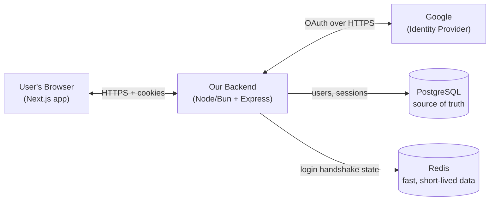

# Authentication Guide — Sign in with Google (OAuth 2.0 / OIDC)

A practical, backend-first guide to building **"Sign in with Google"** from scratch — no SDKs, no Passport.js, no magic. Just the raw protocol, a clean API, and the database behind it.

This guide is written for a solo or small-startup engineer (beginner → intermediate) who wants to _actually understand_ how login works, not just glue a library together.

---

## What we are building

A user clicks **"Continue with Google"**, approves once on Google's screen, and lands back in our app logged in. Under the hood we:

1. Run the **OAuth 2.0 Authorization Code flow** (with PKCE) against Google.
2. Get back proof of who the user is (an **ID token**).
3. Create our **own** user record and our **own** tokens — we never keep depending on Google after login.
4. Keep the user logged in across page loads and devices, securely.

We deliberately **do not** use `google-auth-library`, `passport`, `next-auth`, or any "auth-in-a-box" package. We use only:

| Tool          | Why it's allowed                                                                           | What we use it for                     |
| ------------- | ------------------------------------------------------------------------------------------ | -------------------------------------- |
| Raw `fetch`   | Built-in HTTP                                                                              | Talking to Google's endpoints directly |
| Node `crypto` | Built-in                                                                                   | Random tokens, hashing, PKCE           |
| `jose`        | Generic, standards-based JWT/JWK library — **not** an OAuth framework, not Google-specific | Signing/verifying JSON Web Tokens      |

> We use `jose` only so we don't hand-roll RSA signature verification (which is a security footgun). It does not know what Google or OAuth is. Everything OAuth-specific, we write ourselves.

---

## Scope (read this so expectations are clear)

**In scope**

- One provider: **Google**.
- **JWT access tokens** + **opaque refresh tokens**.
- **Secure by default**: HttpOnly cookies, PKCE, `state`, CSRF protection.
- **Account linking** (schema + flow ready, even though we only have Google today).
- **Per-device sessions**: we record IP, device, OS, browser so the user can see and revoke "this phone", "that laptop".
- A light **audit log** of auth events.
- **Performance**: how to keep authenticated requests under ~100 ms.

**Out of scope (on purpose)**

- Horizontal scaling, sharding, multi-region, 10M-user capacity planning. We assume **one reasonably large server** runs the whole app. We still respect the fundamentals (indexes, stateless verification, caching) — we just don't over-engineer.
- Microsoft / Apple / GitHub login (the design leaves room for them — see [Chapter 5](./05-database-design.md)).
- Roles & permissions (RBAC). Mentioned as a future add-on only.

---

## The big picture (one machine)

- **Browser** — shows the login button, holds the secure cookies. Never sees a Google token.
- **Backend** — does all the real work. This is where 90% of this guide lives.
- **Google** — proves the user's identity. We trust it only at the moment of login.
- **PostgreSQL** — the permanent record: who the user is, their linked accounts, their active sessions.
- **Redis** — a fast scratchpad for data that lives for minutes, not forever (explained in [Chapter 2](./02-system-architecture.md)).

---

## How to read this guide

The chapters build on each other. If you read them in order, every term is defined before it's used — **no forward references, no confusion**.

| #   | Chapter                                            | What you'll understand                                                                |
| --- | -------------------------------------------------- | ------------------------------------------------------------------------------------- |
| 1   | [OAuth Fundamentals](./01-oauth-fundamentals.md)   | What OAuth/OIDC actually is, the players, the tokens, why "Authorization Code + PKCE" |
| 2   | [System Architecture](./02-system-architecture.md) | The components, what each does, and a from-zero explanation of Redis                  |
| 3   | [The Login Flow](./03-login-flow.md)               | The complete step-by-step control flow, with real code for the Google handshake       |
| 4   | [Tokens & Sessions](./04-tokens-and-sessions.md)   | Access vs refresh tokens, rotation, and per-device session tracking                   |
| 5   | [Database Design](./05-database-design.md)         | The tables, the ER diagram, account linking, and the audit log                        |
| 6   | [API Design](./06-api-design.md)                   | Every endpoint: method, request, response, status codes (the backend-first chapter)   |
| 7   | [Security](./07-security.md)                       | The secure-by-default checklist and the attacks each defense stops                    |
| 8   | [Performance](./08-performance.md)                 | Where the milliseconds go and how to stay under 100 ms                                |

---

## The five ideas that make this whole thing click

If you remember nothing else, remember these. The rest of the guide is just detail.

1. **Delegate identity, own the session.** Google proves _who_ the user is — once. After that, _we_ are in charge of keeping them logged in. We don't keep asking Google.
2. **Two tokens, two jobs.** A short-lived **access token** proves "I'm logged in" on every request (fast, checked by math). A long-lived **refresh token** quietly gets you a new access token when it expires (revocable, checked against the database).
3. **The browser holds cookies, not tokens it can read.** Tokens live in **HttpOnly** cookies, so malicious JavaScript can't steal them.
4. **Verify by signature, not by database.** The common case — "is this request logged in?" — is answered by checking a cryptographic signature in memory. No database trip. _That_ is how you stay under 100 ms.
5. **A session is a device.** Each login on each device is its own session row, with its own refresh token. That's what lets a user say "log out my old phone" without logging out everywhere.

---

_Start with [Chapter 1 → OAuth Fundamentals](./01-oauth-fundamentals.md)._
